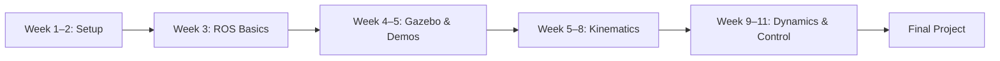

# 🚀 ENME480 — Introduction to Robotics

Fall 2025 • University of Maryland • 3 credits

---

## 🎯 Course overview

**ENME480** blends core theory with practical labs:

- 🤖 **Kinematics & dynamics** — rigid motions, forward/inverse kinematics, planning & control  
- 🧑‍💻 **ROS 2 & Python** — modern robotics tooling and best practices  
- 🧪 **Studios & labs** — translate math into code on **UR3e** industrial arms  
- 👁️ **Vision pipeline** — perception + pick & place for the final project

---

## 🔑 Key facts

- **Instructor:** Dr. Nikhil Chopra — **Office Hours:** Wed 10–11:30, **2149 Martin Hall** (Zoom link in syllabus)  
- **TAs:** Alex Beyer, Kaustubh Joshi — **TA Office Hours:** *TBD*  
- **Course dates:** **Sep 2 – Dec 12, 2025**  
- **Lectures:** **MW 2:00–2:50pm** (**TWS1100**)  
- **Studios (sections):** 0101 Thu 12–2, 0102 Fri 8–10, 0103 Tue 12–2 (**KEB 2111 / EAF 3119**)  
- **Channels:** [Piazza](https://piazza.com/umd/fall2025/enme480), [Canvas](https://elms.umd.edu), [GitHub](https://github.com/ENME480)

<!-- > **Note on rooms:** Syllabus mentions EAF **3119** in the section schedule and **3117** elsewhere. We list **EAF 3119** here; confirm via Schedule/Piazza if updated. -->

---

<!-- 
 -->

[📋 View Syllabus](syllabus.md){ .md-button .md-button--primary }
[🗓️ Schedule](schedule.md){ .md-button }
[🧪 Start Labs](labs/index.md){ .md-button }
[❓ Help](help.md){ .md-button }

<!-- 
 -->

---

## 🚀 Quick start (new students)

1. 📋 Complete [Safety Training]() *(required before robot lab)*  
2. 💻 Set up Ubuntu, Python, and ROS 2 — see [Week 1](labs/week-01.md)  
3. 🐧 Practice Linux/Python basics — [Week 2](labs/week-02.md)  
4. 🤖 Get started with ROS — [Week 3](labs/week-03.md)

---

## 📅 Key dates

> Final dates live on Canvas; midterm weeks appear on the Schedule page.

- **Course runs:** Sep 2 → Dec 12, 2025  
- **Midterm 1:** *TBD (see Schedule)*  
- **Midterm 2:** *TBD (see Schedule)*  
- **Final project demos:** *TBD (last 1–2 weeks)*

---

## 🗓️ This week

<!-- THIS_WEEK:auto:start -->
_(Auto-filled from `data/this_week.yml` by GitHub Actions on each push)_
<!-- THIS_WEEK:auto:end -->

---

## ⚡ What’s new

<!-- WHATS_NEW:auto:start -->
_(Short announcements from `data/this_week.yml`)_
<!-- WHATS_NEW:auto:end -->

---

## 🧭 At a glance

-   :material-calendar-clock:{ .lg .middle } __Meetings__
    ---
    **Lectures:** MW 2:00–2:50 (**TWS1100**)  
    **Studios:** 0101 Thu 12–2 • 0102 Fri 8–10 • 0103 Tue 12–2 (**KEB 2111 / EAF 3119**)
    [:octicons-arrow-right-24: Schedule](schedule.md)

-   :material-clipboard-text:{ .lg .middle } __Grading__
    ---
    Homework **20%** · Studios/Labs **20%** · Midterm 1 **20%** · Midterm 2 **20%** · Final Project **20%** · Extra credit up to **5%**
    [:octicons-arrow-right-24: Policies](policies.md)

-   :material-book-open-page-variant:{ .lg .middle } __Text & tools__
    ---
    Spong/Hutchinson/Vidyasagar, _Robot Modeling and Control_ (2e, 2020).  
    ROS 2 (Humble) + Python; laptop capable of running ROS 2.
    [:octicons-arrow-right-24: Resources](resources.md)

---

## 🏢 Locations

| **Activity** | **Location** | **Room** |
|---|---|---|
| 💻 Programming Studios | Kim Engineering (KEB) | **KEB 2111** |
| 🤖 Robot Lab (RAL) | Engineering Annex Facility (EAF) | **EAF 3119** *(watch Piazza for any changes)* |
| 📚 Office Hours (Instructor) | Martin Hall | **2149** (Wed 10–11:30) |

---

## 🎓 Learning path

