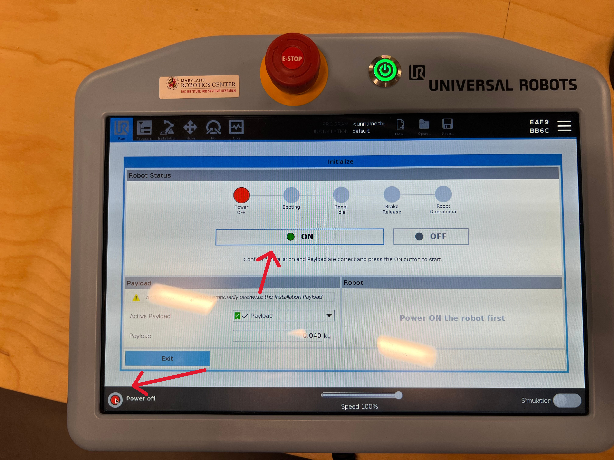
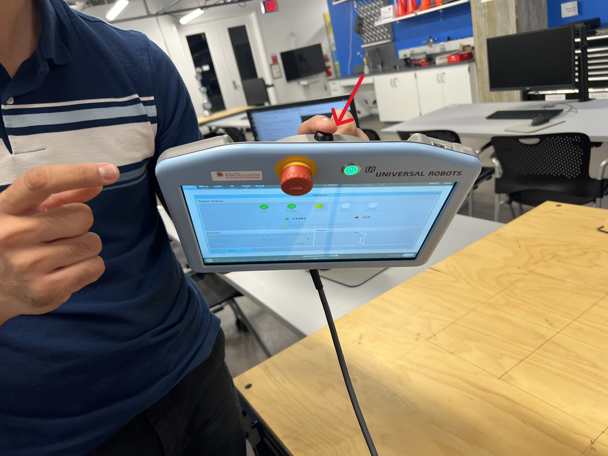
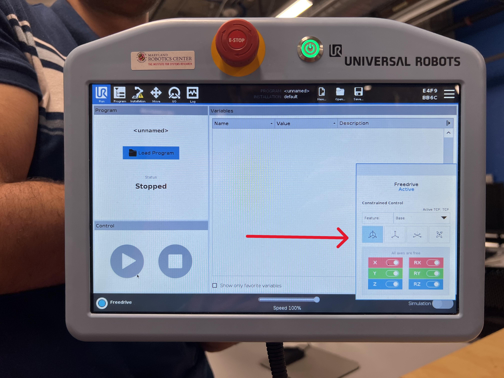
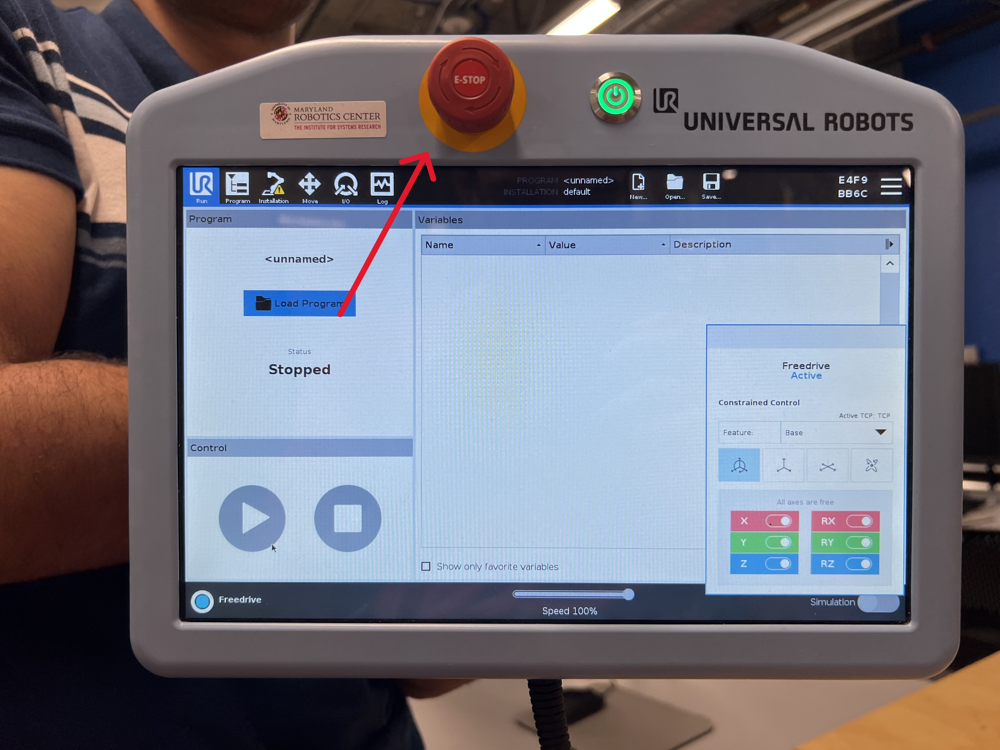
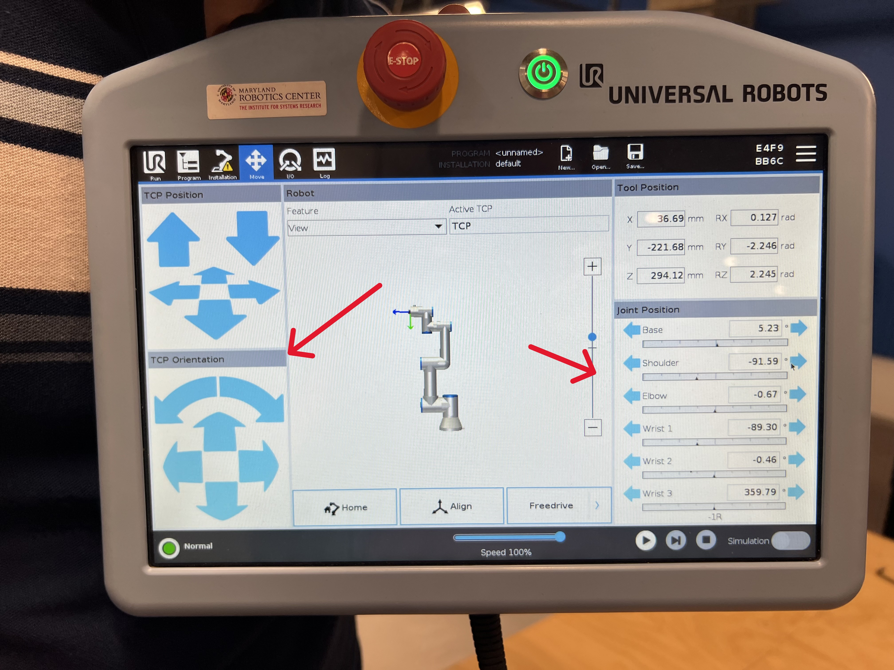
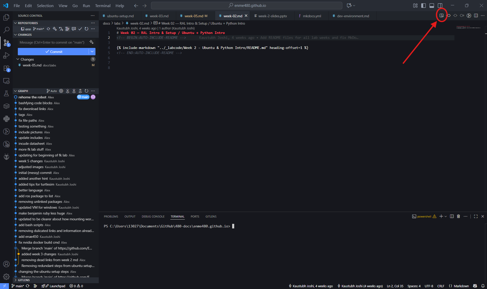

# Week 5 - UR3e Intro & Operation

## Objectives

- Learn how to use the Pendant
- Interface UR3e with ROS packages on RAL machines
- Visualize ROS Processes

## Files
Data Collection Sheet: [pdf](../assets/docs/fk_datasheet.pdf), [docx](../assets/docs/fk_datasheet.docx)


## Procedure

First, you will set up the pendant

Press the power button, shown here:


Once the robot is powered on, it will still be in a disarmed state. Press the button shown below to arm it. You should expect to hear a series of loud clicks; this is the brakes releasing. Note that you will need to press the arm button twice; once to power on the robot and once to release the brakes.



Next, you can try using free drive to control the robot. To do so, press the black button on the back of the teaching pendant. This will allow you to manually move each joint of the robot. Be careful not to do this too quickly otherwise the robot may lock you out.



<!--While holding the freedrive button, you can also add constraints to the robots motion using the screen in the bottom right. Try adding some and seeing how they restrict motion.

 -->

The teaching pendant also has an E-Stop button on its face. *If the robot ever moves in a way you don't expect, E-Stop it.* A stopped robot is better than a hurt classmate or a broken robot. Try pressing it now. In order to release it, you'll need to spin the knob to pop it back up and then re-release the brakes.



<!--For todays lab, you'll be using the teaching pendant to control the position of each of the robots joints. To do this, go to the move screen. You'll see a list of each joint and it's current encoder angle, as well as a set of controls you can use to move the robot in a cartesian frame. Try the different controls out.



Note that by convention we will call movements where you directly set the angle of the joint *Forward Kinematics* (which is what you are doing in class right now and what this lab is about), while motions where you drectly control the position and orientation of the end effector will be called *Inverse Kinematics*.-->

<!--
## 2. DH Parameters of UR3e

Link for UR3e specifications: https://www.universal-robots.com/media/1807464/ur3e-rgb-fact-sheet-landscape-a4.pdf

The PDF for UR3 dimensions is included in the folder for ```Week 6``` and the zero configuration (all joint angles are 0) for the robot looks like [given in this image](images/UR3e_Zero_angle_Config.png)

You need to create a DH-table for the robot and annotate the given PDF to show the frames and axes used. The unknowns here will be the joint angles. Include the base plate in your calculations as well. Note that our given zero frame is not consistent with the zero frame given by Universal Robotics.
-->
<!--
## 3. Creating a Publisher script to move the robot

(NEW) Bridge packages for custom topics between ur_driver and ENME480 labs

- Clone the following repositories into your workspace

```bash
git clone https://github.com/MarylandRoboticsCenter/ur3e_mrc.git
git clone https://github.com/ENME480/ur3e_enme480.git
```
- Build and source your workspace.


We have a predefined custom message for obtaining position and sending commands:

CommandUR3e.msg 
```
float64[] destination
float64 v
float64 a
bool io_0
```
(destination is the set of joint angles `[theta1 theta2 theta3 theta4 theta5 theta6]`)

PositionUR3e.msg
```
float64[] position
bool is_ready
```

(position is the set of 6DoF pose of the end effector `[x y z roll pitch yaw]`)

Now run the following command:
```bash
ros2 launch ur3e_enme480 ur3e_sim_enme480.launch.py
```

You should be able to see the topics `/ur3/position` and `/ur3/command`. Refer to this [link](https://github.com/ENME480/ur3e_enme480/tree/main) for details of the package and its usage.

~~Using the topic ```/joint_trajectory_controller/joint_trajectory``` and the message type ```JointTrajectory``` and ```JointTrajectoryPoint``` from ```trajectory_msgs```, create a publisher to move the robot to desired joint angles. Keep in mind that the angles given to th robot sould be in radians but we want to give the input in degrees so ensure that you have converted that.~~

Using the topic ```/ur3/command``` and the message type ```CommandUR3e``` from ```ur3e_mrc.msg```, create a publisher to move the robot to desired joint angles. Keep in mind that the angles given to the robot should be in radians but we want to give the input in degrees so ensure that you have converted that. You can set the velocity and acceleration as `1.0`

The second step is to create a function (or multiple functions) in the same Python class to calculate the end effector pose using forward kinematics via DH-parameters, and print that out as the final transformation matrix.

Your code will have a structure like this (it can be different but just a baseline)

```python
import ....

class ForwardKinematicsUR3e(...)

  def __init__(self): 
    ...
    ...

  def move_robot(...):
    ...
    ...

  def calculate_fk_from_dh(...):
    ...
    ...

    
def main(...):

  ...
  ...

if __name__ == '__main__':
  main()
```

Hint: Use the structure from your ```pubsub``` codes which you have done previously. ~~You can get the message info for ```JointTrajectory``` and ```JointTrajectoryPoint``` here: http://docs.ros.org/en/noetic/api/trajectory_msgs/html/msg/JointTrajectory.html & http://docs.ros.org/en/noetic/api/trajectory_msgs/html/msg/JointTrajectoryPoint.html~~

Your command should look something like this:

```bash
ros2 run <package_name> ur3e_fk 0 0 0 0 0 0
```
where the numbers represent the six joint angles in degrees. Hint: Look into how you can send arguments to a Python script

Don't forget to add the node to your ```setup.py``` in your package. -->

## 2. Connect the Robot to the Computer
1. Wake the computer up and log in to the enme480 user using the password ENME480 (all caps).
2. Find the "README.md" file within the ENME480_mrc folder. This will contain a list of steps to connect the robot to the computer. You should be dropped into a Docker envrionment similar to the one you've alrady been working in.
  
      2.1. For easier readability, you can open the README file in preview mode by clicking the preview button. This will render all the formatting.
      

3. Follow the steps as laid out in the file. You'll know it worked when the "Control by MRC" script on the robot arm runs succesfully and the computer prints a confirmation message in the terminal. *Warning: E-Stopping the robot while it is controlled by the computer will breka the drivers. You need to redo this process if that happens.*

      3.1. The confirmation command should read: "Robot connected to reverse interface. Redy to receive control commands." and will print in the terminal where you are running ur_robot_control driver.
      3.2. Be careful not to use the touchpad functions on the pendant once you've launched the driver. If you do, you'll have to relaunch the driver.

## 3. Enabling the Laser and Publishing Joint Angles to the Robot

1. Now we are ready to begin publishing joint angles to the robot. To do this, run the command with angles on your datasheet.

```bash
ros2 topic pub --once /ur3/command ur3e_mrc/msg/CommandUR3e "destination: [tht1, tht2, tht3, tht4, tht5, tht6] v: 1.0 a: 1.0 io_0:false"
```

This message contains a few parts:
- "ros2 topic pub --once" will publish a message on a certain topic once, then stop (instead of endlessly republishing the same message).
- We are publishing on the topic "ur3/command" with a message type "ur3e_mrc/msg/CommandUR3e"
- The "ur3e_mrc/msg/CommandUR3e" message has four fields:
  
  - "destination": a set of 6 angles, one per joint. ***These angles are in RADIANS! Sanity check any angle you're putting in before hitting enter - an angle of +/-90 probably doesn't make sense here, for example.***
  - "v" and "a": these control the velocity and acceleration of the robots joints, respectively. There are internal afeties set to prevent the robot from moving too fast, but we've also explicitly set the speed here to something low enough that you'll have time to react if the robot moves unexpectedly.
  
  - "io_0": this field will turn the laser pointer off during the motion of the arm. This is to make sure the laser never accidentally shines in someones eyes.

2. The TAs should have attached a laser pointer to your robot. In order to enable the laser pointer run the command:

```bash
ros2 topic pub --once /ur3/laser_point std_msgs/msg/Bool "data: true"
```

From within the docker. Your laser should now be on, so make sure the robot only points down towards the table. *If your laser still is not on, call a TA.*

3. Check the data sheets we handed out in lab for the angles you need to populate the command. For this lab, you will be measuring the coordinates of where the laser pointer hits the table after each move. Make sure youre using the set of axes defined on the table.

## Wrap Up and Shutdown

Once you are done you can use any time you have left to redo some of what we showed during the prior lab with listing topics and using RQT to see how the robot works under the hood. 

Before leaving, rehome the robot by going to the "Move" screen and clicking the "Home" button in the bottom middle of the screen. You will then need to hold down the "Move to new position" button until the robot is fully in position, at which point the screen will change to confirm the mvoe is complete. *Make sure that you fully shut the robot down and close all temrinals on the computer before you leave!*


## Next Steps

In next weeks lab we will show you how to calculate the forward kinematics for our 6 DoF robot usng DH parameters and then how to simulate the Forward Kinematics using Gazebo. The goal of this weeks lab is to get data that you can validate during next weeks lab. If you'd like to get ahead, you can also being working out how to project the laser pointer down onto the table if you given a homogenous transform showing the position and orientation of the pointer.

## Submission

No submissions for this week. However, make sure you collect the data for this week properly. There will be a joint submission with next week's studio covering the entire forward kinematics assignment.

<!-- 1. Show a screenshot of the base plate with the robot 

2. Show the DH Table for the robot

3. Show a figure with frames and axes marked

4. For each test case, show:

- The set of joint angle values (θ1, θ2, θ3, θ4, θ5, θ6)
- The final transformation matrix (from Python script). You can
add it as a readable image of the output window as well.
- The calculated pose from DH table in simulation vs the pose from ```/ur3/position```
- The scalar error

5. Discuss the sources of error

6. An appendix to show your scripts

- ```enme480_fk.xacro```
- FK publisher (including the Python script for DH transformation)
- ~~```tf``` subscriber~~ Screenshot of messages received from `/ur3/position`

Add everything in one single PDF file and upload it. -->


<!--
2. Interfacing the Robot with PC

Now that you've seen the teaching pendant we also want to demonstrate some of the same visualization tools you saw in the prior lab on the real robot. First, log into the ENME480 account on the computers (password ENME480) and locate the *commands2run.txt* file.  Open the file and follow the instructions within to allow the computer to control the robot. *Once this is done, the only control on the pendant which will do anything is the E-Stop button.* It is important whenever you are running code that one of your groupmates is holding the pendant and is ready to E-Stop if the robot moves unpredictably. 


3. Visualize ROS Processes on the Physical System


- Get the list of ROS topics
- Open up RQT
- Visualize Node Graphs
- You will be shown how to generate plots in RQT to analyze data
--!>


