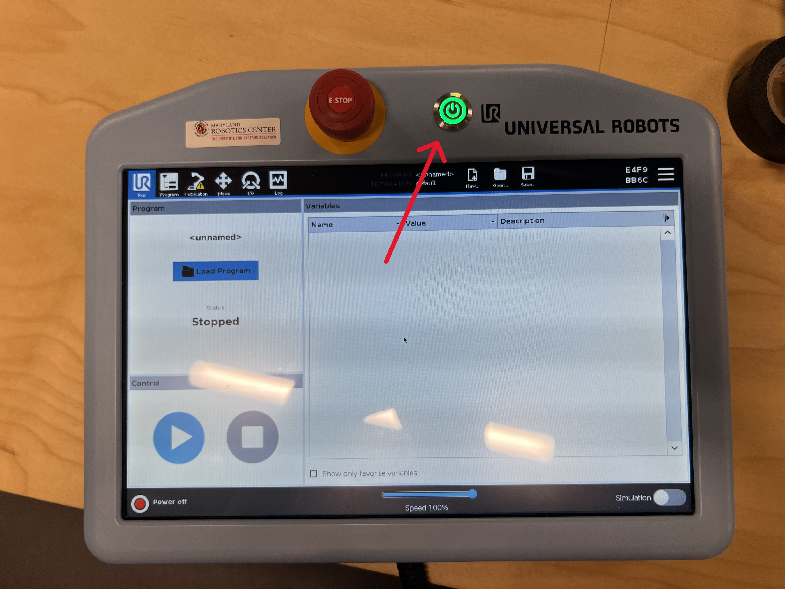
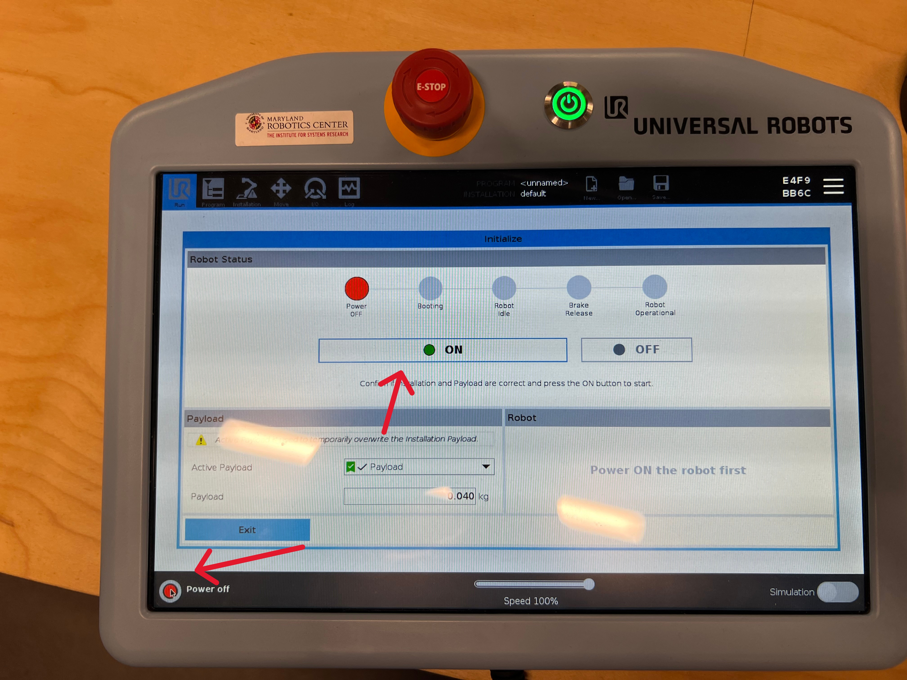
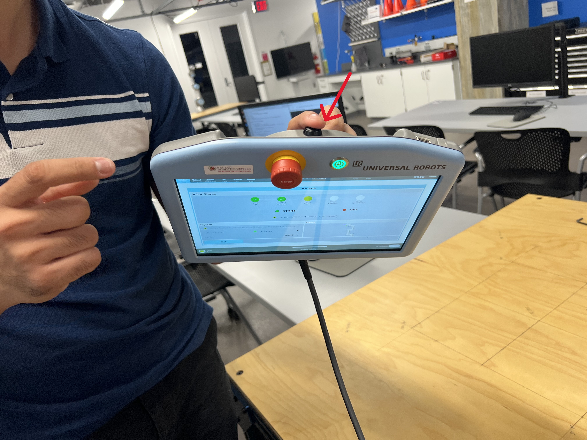
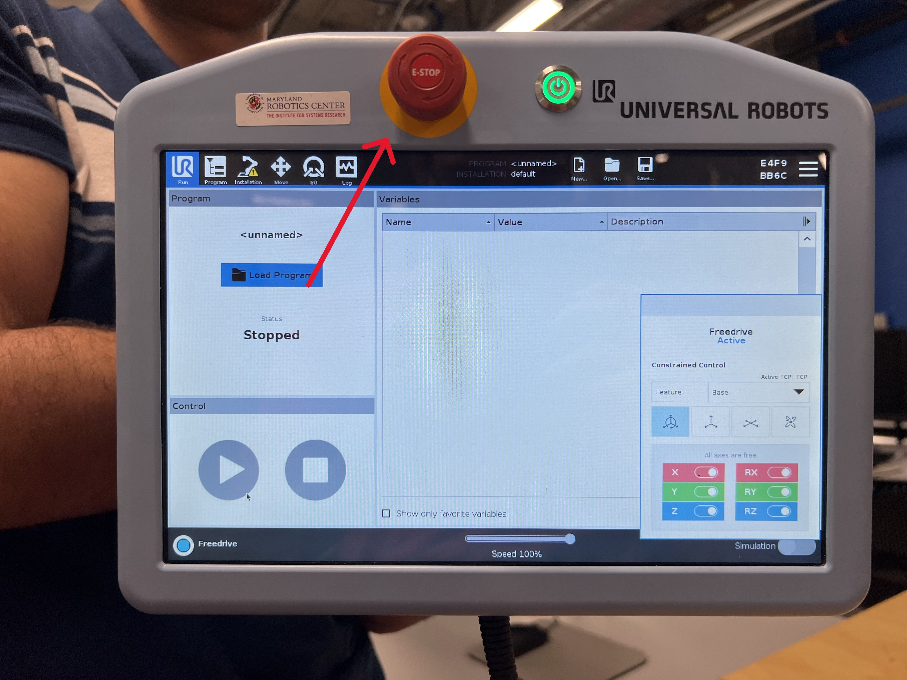
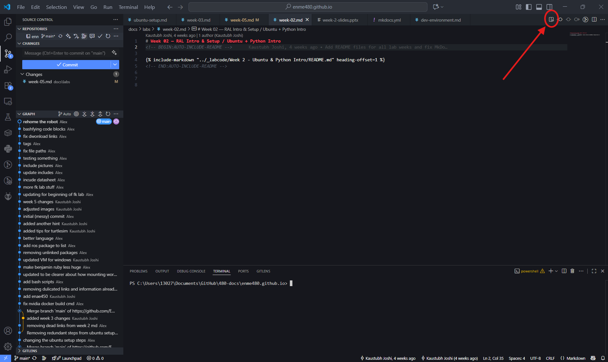

# Week 5 - UR3e Intro & Operation

## Objectives

- Learn how to use the Pendant
- Interface UR3e with ROS packages on RAL machines
- Visualize ROS Processes

## Files
Data Collection Sheet: [pdf](../assets/docs/fk_datasheet.pdf), [docx](../assets/docs/fk_datasheet.docx)


## Procedure

### Powering on the UR3e {#powering-on-the-ur3e}

First, you will set up the pendant

Press the power button, shown here:



Once the robot is powered on, it will still be in a disarmed state. Press the button shown below to arm it. You should expect to hear a series of loud clicks; this is the brakes releasing. Note that you will need to press the arm button twice; once to power on the robot and once to release the brakes.



Next, you can try using free drive to control the robot. To do so, press the black button on the back of the teaching pendant. This will allow you to manually move each joint of the robot. Be careful not to do this too quickly otherwise the robot may lock you out.



The teaching pendant also has an E-Stop button on its face. *If the robot ever moves in a way you don't expect, E-Stop it.* A stopped robot is better than a hurt classmate or a broken robot. Try pressing it now. In order to release it, you'll need to spin the knob to pop it back up and then re-release the brakes.



## 2. Connect the Robot to the Computer
1. Wake the computer up and log in to the enme480 user using the password ENME480 (all caps).
2. Find the `README.md` file within the `ENME480_mrc` folder. You can also open up VS Code from the sidebar and open the `ENME480_mrc` folder and open the `README.md` file from there. Do `Ctrl + Shift + V` to enable a more readable view of the README file. This will contain a list of steps to connect the robot to the computer. You should be dropped into a Docker envrionment similar to the one you've alrady been working in.
  
      2.1. For easier readability, you can open the README file in preview mode by clicking the preview button. This will render all the formatting.
      

3. Follow the steps as laid out in the file. You'll know it worked when the "Control by MRC" script on the robot arm runs succesfully and the computer prints a confirmation message in the terminal. The confirmation command should read: "Robot connected to reverse interface. Redy to receive control commands." and will print in the terminal where you are running ur_robot_control driver. Be careful not to use the touchpad functions on the pendant once you've launched the driver. If you do, you'll have to relaunch the driver. *Warning: E-Stopping the robot while it is controlled by the computer will breka the drivers. You need to redo this process if that happens.*

## 3. Enabling the Laser and Publishing Joint Angles to the Robot

1. Now we are ready to begin publishing joint angles to the robot. To do this, run the command with angles on your datasheet.

```bash
ros2 topic pub --once /ur3/command ur3e_mrc/msg/CommandUR3e "destination: [tht1, tht2, tht3, tht4, tht5, tht6] 
v: 1.0 
a: 1.0 
io_0: false"
```

This message contains a few parts:
- "ros2 topic pub --once" will publish a message on a certain topic once, then stop (instead of endlessly republishing the same message).
- We are publishing on the topic "ur3/command" with a message type "ur3e_mrc/msg/CommandUR3e"
- The "ur3e_mrc/msg/CommandUR3e" message has four fields:
  
  - "destination": a set of 6 angles, one per joint. ***These angles are in RADIANS! Sanity check any angle you're putting in before hitting enter - an angle of +/-90 probably doesn't make sense here, for example.***
  - "v" and "a": these control the velocity and acceleration of the robots joints, respectively. There are internal safeties set to prevent the robot from moving too fast, but we've also explicitly set the speed here to something low enough that you'll have time to react if the robot moves unexpectedly.
  
  - "io_0": this field will turn the laser pointer off during the motion of the arm. This is to make sure the laser never accidentally shines in someones eyes.

2. The TAs should have attached a laser pointer to your robot. In order to enable the laser pointer run the command:

```bash
ros2 topic pub --once /ur3/laser_point std_msgs/msg/Bool "data: true"
```

From within the docker. Your laser should now be on, so make sure the robot only points down towards the table. *If your laser still is not on, call a TA.*

3. Check the data sheets we handed out in lab for the angles you need to populate the command. For this lab, you will be measuring the coordinates of where the laser pointer hits the table after each move. Make sure youre using the set of axes defined on the table.

## Wrap Up and Shutdown

Once you are done you can use any time you have left to redo some of what we showed during the prior lab with listing topics and using RQT to see how the robot works under the hood. 

Before leaving, rehome the robot by going to the "Move" screen and clicking the "Home" button in the bottom middle of the screen. You will then need to hold down the "Move to new position" button until the robot is fully in position, at which point the screen will change to confirm the mvoe is complete. *Make sure that you fully shut the robot down and close all temrinals on the computer before you leave!*


## Next Steps

In next weeks lab we will show you how to calculate the forward kinematics for our 6 DoF robot usng DH parameters and then how to simulate the Forward Kinematics using Gazebo. The goal of this weeks lab is to get data that you can validate during next weeks lab. If you'd like to get ahead, you can also being working out how to project the laser pointer down onto the table if you given a homogenous transform showing the position and orientation of the pointer.

## Submission

No submissions for this week. However, make sure you collect the data for this week properly. There will be a joint submission with next week's studio covering the entire forward kinematics assignment, which will require this weeks data. 

