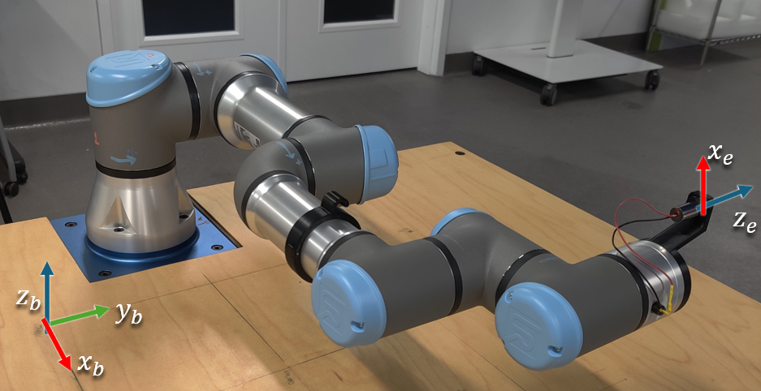
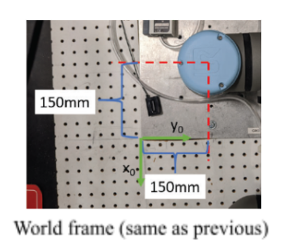
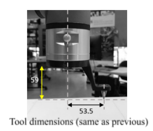

# Week 06 — Forward Kinematics Lab 1.2

## Objectives

- Implement a ROS 2 publisher node (Python/rclpy) to command a UR3e in Gazebo.
- Derive the Forward Kinematics for the UR3e using DH Transformations
- Validate FK numerically against the simulator’s reported pose and reason about modeling error sources. Compare against the values obtained from last week's lab 

## Useful Files

- [UR3e Dimensions](../assets/fk/UR3e_Zero_angle_Config.png)
- [UR3e Zero Position](../assets/fk/ur3eschem.png)

## Procedure

### Step 1: Pull the latest version of the Repo

The repository and docker files has been updated to include the updated simulation tools so you'll need to build the docker environment again

Before doing that take a backup of your current `/src` folder so that you don't accidentally lose access to your previous work.

```bash
cd
mkdir -p backup/week5
cp -r ~/ENME480_mrc/src/ ~/backup/week5
```

Next, we pull the latest version of the repository

```bash
cd ~/ENME480_mrc
git checkout .
git pull
```

Next, we add a helper package to the repository:

```bash
cd ~/ENME480_mrc/src
git clone https://github.com/ENME480/ur3e_enme480.git
```

### Step 2: Build and run docker

**For MacOS/VM users**, change Line no. 4 in the docker file `humble-enme480_ur3e.Dockerfile` at `~/ENME480_mrc/docker`

```
# BEFORE
FROM osrf/ros:humble-desktop AS humble-mod_desktop

# AFTER
FROM arm64v8/ros:humble AS humble-mod_desktop
```

**Do not do this on anything other than a MAC!** MACs require code that has been compiled in a special way in order to work and this code does not work on other computers!

**For Everyone**, run

```bash
cd ~/ENME480_mrc/docker/
userid=$(id -u) groupid=$(id -g) docker compose -f humble-enme480_ur3e-compose.yml build
```

Create the `startDocker.sh` and `connectToDocker.sh` scripts again if you haven't yet

For people **not** using the Nvidia container, run:
```bash
cd

echo -e "#"'!'"/bin/bash\nexport userid=$(id -u) groupid=$(id -g)\ncd ~/ENME480_mrc/docker\ndocker compose -f humble-enme480_ur3e-compose.yml run --rm enme480_ur3e-docker" > startDocker.sh

echo -e "#"'!'"/bin/bash\ncontainer="'$(docker ps | grep docker-enme480_ur3e-docker-run | cut -b 1-12)'"\necho Found running container "'$container'". Connecting...\ndocker exec -ti "'$container'" bash" > connectToDocker.sh
```

For people who **are** using the Nvidia container, run:
```bash
cd 

echo -e "#"'!'"/bin/bash\nexport userid=$(id -u) groupid=$(id -g)\ncd ~/ENME480_mrc/docker\ndocker compose -f humble-enme480_ur3e-nvidia-compose.yml run --rm enme480_ur3e-docker" > startDocker.sh

echo -e "#"'!'"/bin/bash\ncontainer="'$(docker ps | grep docker-enme480_ur3e-docker-run | cut -b 1-12)'"\necho Found running container "'$container'". Connecting...\ndocker exec -ti "'$container'" bash" > connectToDocker.sh
```

To start the docker container, run

```bash
bash startDocker.sh
```

To connect to the same docker container from another terminal, run

```bash
bash connectToDocker.sh
```

### Step 3: Build the workspace

#### Preliminary instllations

```bash
sudo apt update
sudo apt install ros-humble-tf-transformations
sudo apt install ros-humble-rqt*
```

Now, we build the workspace for the simulation

```bash
cd ~/enme480_ws
colcon build --symlink-install
```
`--symlink-install` speeds Python iteration by avoiding rebuilds for script-only changes.

Once done, source it

```bash
cd ~/enme480_ws
source install/setup.bash
```

### Step 4: Launch the Simulation

Now we will test if the simulation environment is working

* Use `tmux` to manage multiple panes. Create several panes to work with the Gazebo simulation:
  * `tmux`      # Start a new session
  * `Ctrl+A b`  # Split horizontally
  * `Ctrl+A v`  # Split vertically

* **Terminal/Pane 1:** Launch MRC UR3e Gazebo simulation in one of the `tmux` panes:
    ```
    ros2 launch enme480_sim enme480_ur3e_sim.launch.py
    ```
* **Terminal/Pane 2:** Launch MRC UR3e sim control package in a different `tmux` pane:
    ```
    ros2 launch ur3e_mrc_sim ur3e_enme480.launch.py
    ```

* **Terminal/Pane 3:** Launch MRC UR3e sim control package in a different `tmux` pane:
    ```
    ros2 launch ur3e_enme480 ur3e_sim_enme480.launch.py
    ```

* **Terminal/Pane 4:** Example command to move the arm:
    ```
    ros2 topic pub --once /ur3e/command ur3e_mrc_msgs/msg/CommandUR3e "destination: [0, -1.57, -1.57, 0, 0, 0]
    v: 1.0
    a: 1.0
    io_0: false" 
    ```    

### Step 5: Solve the UR3e DH Table

The main point of todays lab is to validate the measurements you took in lab last week. To do this, you will be solving the Forward Kinematics for the UR3e arm. Below, we have included some helpful images to get you started.



This is the robot in its zero configuration. Your DH Table should correspond to this when you have all free variables set to 0.



A top down view of the offset for the corner point.



Tool dimensions.


This is a schematic showing the lengths of the different links on the robot.


Tips:

- The physical robots are set up assuming that the z-axis is always pointing *out of* the blue caps.
- Remember that you can make fixed DH Frames that don't have any free parameters. Sometimes, a transform may not be doable using the standard DH convention and this is necessary.
    - A common scenario is that a transform you want to do would require a translation or rotation about a y-axis, which is not allowed with DH parameters. In these cases, you will always end up needing an intermediate fixed frame.
- Each one of the 6 blue caps on the robot is a motor, meaning each one introduces a new free varaible representing the bending in the joint.
    - This means that, counting the base frame (0) and the end effector frame (E) you should have minimum 8 DH frames.
- Your code should be a funciton which takes in a list of angles (free DH parameters) and returns the transform between the base and end effector.


### Step 6: Create a publisher script to move the arm

Here, you need to write a publisher script to:

- Move the robot (using `/ur3e/command`)
- Calculate the end effector position using DH Transformations

You are encouraged to write the entire publisher script on your own, but we have also provided a helper script if needed.

The script is located at `~/enme480_ws/src/ur3e_enme480/ur3e_enme480/ur3e_fk.py`.

In the helper script, we have added an approximately correct end effector transformation matrix relative to the table's origin `(0,0)` for reference. The script also calculates an estimated position where the laser pointer will hit the workbench depending on the DH calculations. 

Some tips for finishing the script:

- Finish the `send_command()` first with a placeholder matrix for the transformation
- To finish the `send_command()` function, the message definition for `CommandUR3e.msg` is 

```
float64[] destination
float64 v
float64 a
bool io_0
```

Do this similar to the way you wrote the publisher messages for previous weeks

- The helper script defines an identity matrix as placeholder to ensure you can test the script first. Make sure that you change this with your final transformation matrix.
- You can implement a recursve method or do a matrix multiplication of your choosing to calculate the final trnasformation matrix in the code.

It can be launched as follows:

```bash
ros2 run ur3e_enme480 ur3e_fk <th1> <th2> <th3> <th4> <th5> <th6>
```

You should also be able to see the approximate final position of the end-effector fromm the `ur3/position` topic:

```bash
ros2 topic echo /ur3/position 
```

This will provide a final position and orientation of your end effector. Another way to validate it is using the "Approximately Correct DH Matrix" that's printed on your terminal when you launch the command to move the orbot. You need to ensure that your values are relatively close to the correct one.

Since you know the position and orientation of the end effector (attached with a laser pointer), you have to predict where the laser point will land on the workbench. (Hint: Think in terms of vector and plane intersection)

Assume the `z_table = 0`. 

We are providing you with the code in lab (hidden in the backend), but you need to show the math behind it in your lab report.


## Test Points (same as last week)

Run the robot for the following test points:

| Test Point Inputs (𝜽𝟏, … 𝜽𝟔)    | End Effector Position (Your Code) `(x y z)`        | Laser Position on Workbench (from Code) (`x,y`) | Laser Position on Workbench(Measured) `(x, y)` |
| --------------- |:---------------:| --------:| --------:|
| [0, -0.758, 0, 0.758, -1.571, 1.048] | | |
| [-0.524, -1.048, 1.396, -0.175, -1.571, -0.524] | | |
| [0.524, -1.222, 1.396, -0.175, -1.571, 0.175] | | |
| [-0.524, -1.048, 1.048, -0.175, -1.571, -0.524] | | |


## Deliverables/Submission

### Report (PDF)

- Clear frame assignments & axes drawings.

- DH table with your chosen convention and parameter definitions. 

- Step-by-step derivation for the laser–plane intersection.

- Error analysis (≥3 points): quantify FK vs. sim pose (from `/ur3/position`) vs. correct DH transform and laser prediction error; discuss atleast 4-5 sources of error

- Short description of your publisher (design & message format).

### Code

- The FK function and the publisher function you modified (with comments).

### Results

- Filled test table (above).

- Plots or tables comparing predicted vs. measured laser positions.


Feel free to explore tools like `rqt` to get a deeper understanding of how the nodes are interacting with each other.