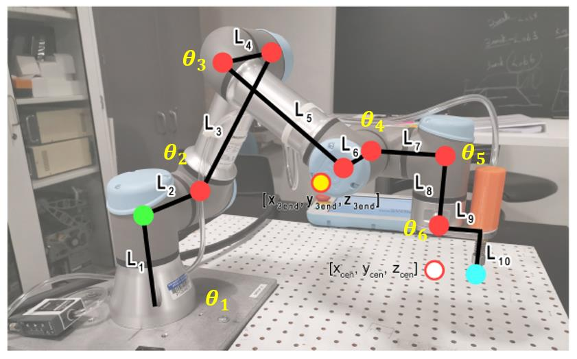

# Week 8 - UR3e Inverse Kinematics on Gazebo

## Objectives

The objective of this lab is to derive and implement a solution to the inverse kinematics problem for the UR3 robot. In this lab we will:

- Derive elbow-up inverse kinematic equations for the UR3
- Write a publisher that moves the UR3 to a point in space specified by the user

> **Important:** You are expected to do the geometry/trigonometry yourself.

## Helpful Resources

- [Trignometry & Geometry Cheat Sheet](../assets/ik/trig_cheat_sheet.pdf) 
  - Ref: https://tutorial.math.lamar.edu/pdf/trig_cheat_sheet.pdf


## Task Description

The joints and links of the UR3 robot are annotated in Figure 1. The goal is to find the rotation
angles of the 6 joints `(θ1, ... , θ6)`, so that the end-effector (end of Link 10) can reach to a given
position `(x_grip, y_grip, z_grip)` and orientation `{θ_yaw, θ_pitch, θ_roll}` input by the user.
There are many possible solutions to the inverse kinematics problem. To make the derivation
manageable, we will only implement one of the elbow-up solution in this lab. `θ_pitch` and `θ_roll` of
the end-effector are fixed by letting the vacuum gripper aluminum plate (Link 9) always be
parallel to the x-y plane of world frame coordinates (i.e., desk plane), and θ5 is always equal to −90°. Thus, the user will input the desired position and yaw angle of the end-effector in world
frame coordinates `(xWgrip, yWgrip, zWgrip, yawWgrip)`, and the output of the program should
be the joint angles `θ1 to θ6`.



Here's a table for the link lengths from the [UR3e Dimensions](../../docs/assets/fk/ur3eschem.png). Write your math in terms of the variables for the links, instead of using their numerical value.


| Link   | Length (in m)         | 
| ------------- |:-------------:| 
| L1 | 0.152
|L2 | 0.120
|L3| 0.244
|L4| 0.093
|L5 | 0.213     |     
| L6 | 0.104
|L7 | 0.083
|L8| 0.092
|L9| 0.059
|L10 | 0.0535     |     

## Solution Steps

In this section, a suggested solution approach is described.


### Step 1

Establish the world coordinate frame (`frame w`) centered at the corner of the UR3’s base shown in the image below. We will solve the inverse kinematics problem in the base frame (`frame 0`), so we will convert the coordinates (𝑥𝑤−𝑔𝑟𝑖𝑝, 𝑦𝑤−𝑔𝑟𝑖𝑝, 𝑧𝑤−𝑔𝑟𝑖𝑝) entered by the user to base frame coordinates (`𝑥𝑔𝑟𝑖𝑝, 𝑦𝑔𝑟𝑖𝑝, 𝑧𝑔𝑟𝑖𝑝`). The origin of the base frame is at (`-0.15, 0.15, 0.01`) in
the world frame. Set `𝜃5 = −90°` in unit of radian."

**Hints**

* This is a **pure translation** (axes are parallel). Keep units in **meters**.
* Convert yaw input **degrees → radians** immediately at the start of your function.


### Step 2

We will define a “wrist center” as 𝑧𝑐𝑒𝑛 which equals the same desired 𝑧 value of the vacuum gripper, and 𝑥𝑐𝑒𝑛, 𝑦𝑐𝑒𝑛 are the coordinates of `𝜃6`’s 𝑧 axis (see Figure 1). Link 9 (gripper plate) has a length of 0.0535 meters from the center line of the gripper to the center line of Joint 6. Given the desired position of the gripper `(𝑥𝑔𝑟𝑖𝑝, 𝑦𝑔𝑟𝑖𝑝, 𝑧𝑔𝑟𝑖𝑝)` in the base frame and the yaw angle, find wrist’s center point (`𝑥𝑐𝑒𝑛, 𝑦𝑐𝑒𝑛, 𝑧𝑐𝑒𝑛`).

**Hints**

* Think: “from the gripper target, walk **back** along its yaw direction by 0.0535 m to reach Joint 6.”
* Keep the **sign conventions** consistent with your world/base axes and yaw definition.
* Do not overthink: this is a **short, straight translation** in the gripper’s yaw direction.

**Sanity check**

* If yaw points straight “forward” in your world, the wrist center is simply a **small step behind** the gripper target in that same horizontal line.

### Step 3

Given the wrist’s center point (𝑥𝑐𝑒𝑛, 𝑦𝑐𝑒𝑛, 𝑧𝑐𝑒𝑛), find the waist angle 𝜃1. Figure 3 shows the
top-down view of the robot, which is helpful for formulating the relations.

### Step 4

Solve for the value of `𝜃6`, given 𝜃1 and the desired yaw angle (should be converted to radian from the input degree value). `𝜃6 = 0` when Link 9 is parallel to Link 4 and Link 6.

### Step 5

We will define another virtual point. A projected end point `(𝑥3𝑒𝑛𝑑, 𝑦3𝑒𝑛𝑑, 𝑧3𝑒𝑛𝑑)` is a point off the UR3 but lies along the Link 6 axis, as shown in Figure 1 and Figure 3. For example, if `𝜃1 = 0` then `𝑦3𝑒𝑛𝑑 = 0`. If `𝜃1 = 90°` then `𝑥3𝑒𝑛𝑑 = 0`. Use the top-down view (Figure 3) to find `𝑥3𝑒𝑛𝑑` and `𝑦3𝑒𝑛𝑑` from `𝑥𝑐𝑒𝑛, 𝑦𝑐𝑒𝑛`. Figure 4 is a side view that is a projection of the robot onto a plane
perpendicular to the x-y plane of world frame and rotated by `𝜃1` about the base frame. From
this figure we can see that `𝑧3𝑒𝑛𝑑` is 𝑧𝑐𝑒𝑛 offset by a constant. The end of the gripper is 0.052m from the center of the gripper plate in the z-axis direction.


### Step 6

Find `𝜃2`, `𝜃3` and `𝜃4` from the end point (𝑥3𝑒𝑛𝑑, 𝑦3𝑒𝑛𝑑, 𝑧3𝑒𝑛𝑑). In Figure 4, a parallel to the base construction line through Joint 2 and a parallel to the base construction line through Joint 4 are helpful in finding the needed partial angles. 𝜃2 and 𝜃3 can be found from the geometry, while 𝜃4 is determined due to the requirement that Link 7 and Link 9 must be parallel to the
x-y plane of the world frame.

Now that your code solves for all the joint variables `(𝜃1 to 𝜃6)`, send these six values to the publisher you created in FK lab to move the robot to those angles so that it gets to the desired position.

## Implementation in ROS2 & Gazebo

### Step 1: Pull the latest version of the Repo

The repository has been updated to include updated simulation tools and helper scripts so you'll need to pull the latest version

Before doing that take a backup of your current `/src` folder so that you don't accidentally lose access to your previous work.

```bash
cd
mkdir -p backup/week6
cp -r ~/ENME480_mrc/src/ ~/backup/week6
```

Next, we pull the latest version of the repository

```bash
cd ~/ENME480_mrc
git checkout .
git pull
```

Next, we pull the latest version of the helper package repository:

```bash
cd ~/ENME480_mrc/src/ur3e_enme480
git checkout origin/main -- ur3e_enme480/submodules/kinematic_functions.pyc
git pull
```

#### Troubleshooting
If you have an error in pulling the commit, run the following commands, assuming you have a backup of your previous codes:

```bash
cd ~/ENME480_mrc/src/ur3e_enme480
git checkout .
git pull
```

### Step 2: Start the Docker Container

To start the docker container, run

```bash
bash startDocker.sh
```

To connect to the same docker container from another terminal, run

```bash
bash connectToDocker.sh
```

### Step 3: Build the workspace

Once in the docker dcontainer:

#### Preliminary instllations

```bash
sudo apt update
sudo apt install ros-humble-tf-transformations
sudo apt install ros-humble-rqt*
```

Now, we build the workspace for the simulation

```bash
cd ~/enme480_ws
colcon build --symlink-install
```
`--symlink-install` speeds Python iteration by avoiding rebuilds for script-only changes.

Once done, source it

```bash
cd ~/enme480_ws
source install/setup.bash
```

### Step 4: Complete the IK Script Node

Find the script in `~/ENME480_mrc/src/ur3e_enme480/ur3e_enme480/ur3e_ik.py` and complete the function `inverse_kinematics()`

### Step 5: Launch the Simulation

Now we will test if the simulation environment is working

* Use `tmux` to manage multiple panes. Create several panes to work with the Gazebo simulation:
  * `tmux`      # Start a new session
  * `Ctrl+A b`  # Split horizontally
  * `Ctrl+A v`  # Split vertically

* **Terminal/Pane 1:** Launch MRC UR3e Gazebo simulation in one of the `tmux` panes:
    ```
    ros2 launch enme480_sim enme480_ur3e_sim.launch.py
    ```
* **Terminal/Pane 2:** Launch MRC UR3e sim control package in a different `tmux` pane:
    ```
    ros2 launch ur3e_mrc_sim ur3e_enme480.launch.py
    ```

* **Terminal/Pane 3:** Launch ENME480 UR3e sim control package in a different `tmux` pane:
    ```
    ros2 launch ur3e_enme480 ur3e_sim_enme480.launch.py
    ```

* **Terminal/Pane 4:** Run the IK node once script is completed in a different `tmux` pane:
    ```
    ros2 run ur3e_enme480 ur3e_ik <x> <y> <z> <yawAngle>
    ```


## Test Cases

| Test Point Inputs (x, y, z, yaw)    | IK solution (𝜽𝟏, … 𝜽𝟔)           | Output from `/ur3/position`  |
| ------------- |:-------------:| -----:|
| (0.2, 0.3, 0.3, 45) | |
|(0.1, 0.4, 0.1, 90) | |
|(0.2, 0.2, 0.2, 0) | |
|(0.2, -0.2, 0.1, 0) | |
|(0.2, 0.3, 0.4, 30) |      |     |


## Submission

1.  A pdf of your code complete with comments describing the steps you've taken
2.  A pdf containing a (neatly) written/typed solution for IK showing how you derived your equations from the geometry
3. Screenshots of UR3e in Gazebo for all test cases
4.  A comparison of error between your IK script and the output of the ```ur3/position``` topic for the test cases with a discussion of possible error sources.
5.  A brief discussion of any possible singularities in the math and what could be done to avoid them (you don't need to implement this, we just want you thinking about strategies!)
