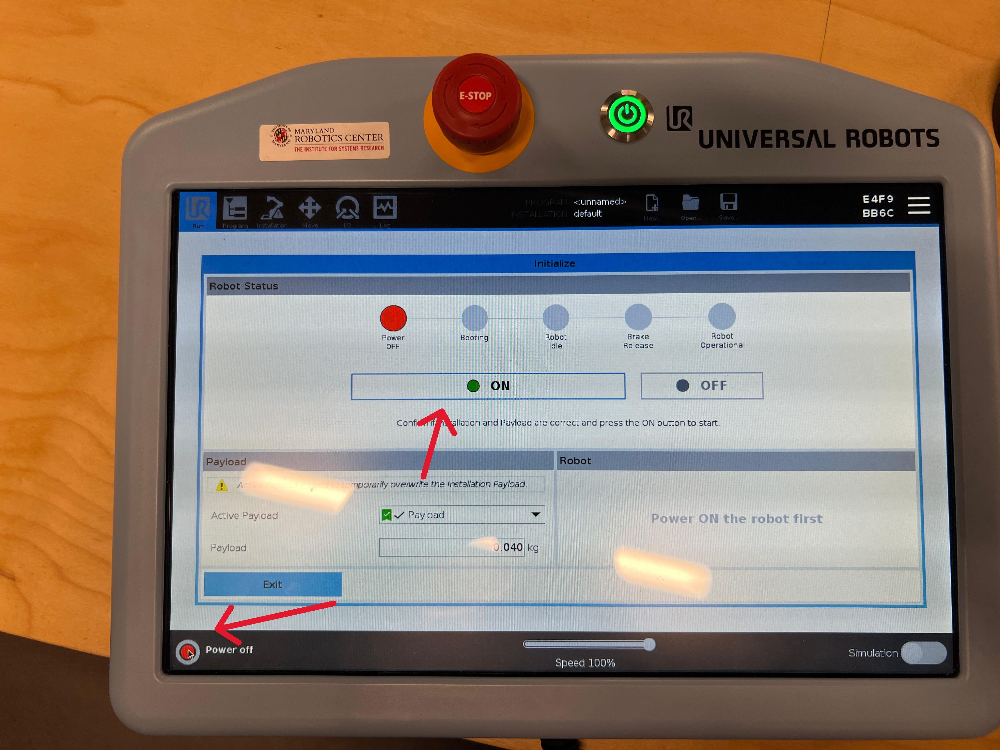
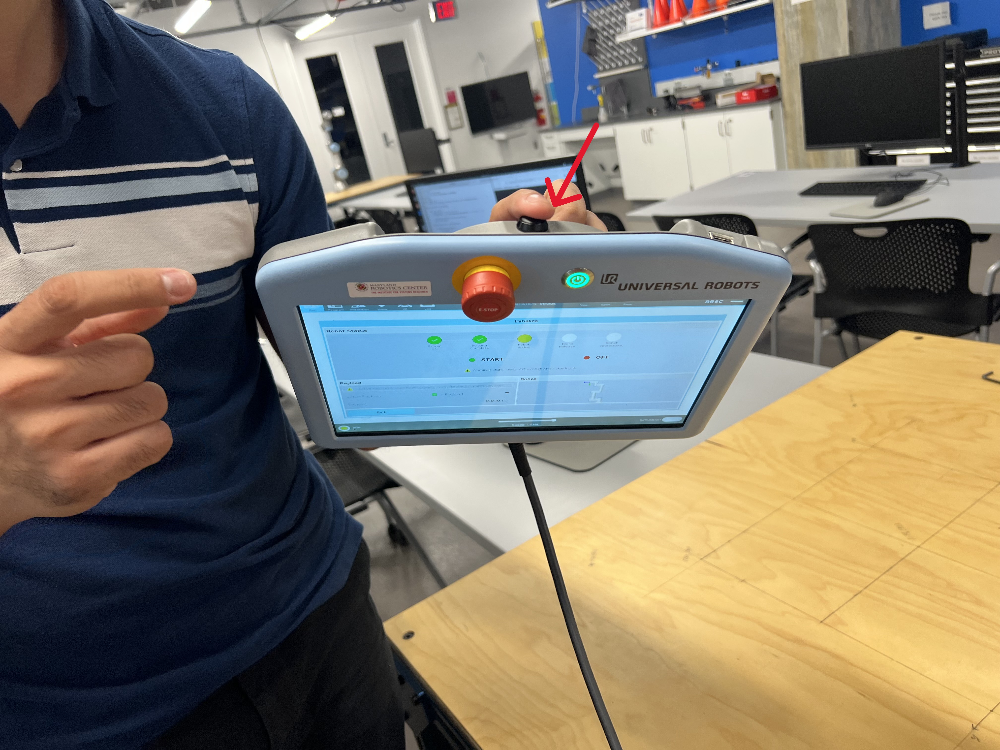
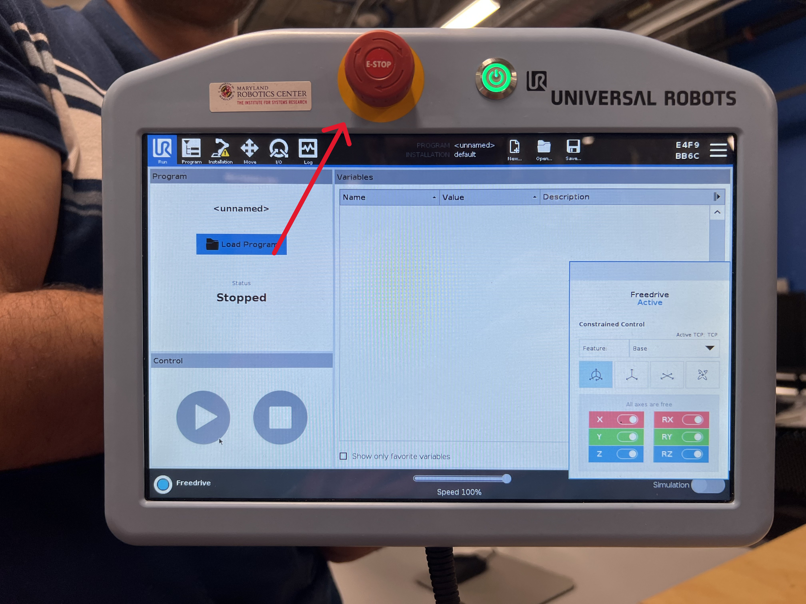

# Week 9 - UR3e Inverse Kinematics

## Objectives

- Run your IK script on the UR3e Robot

## Files
Data Collection Sheet: [pdf](../assets/docs/fk_datasheet.pdf), [docx](../assets/docs/fk_datasheet.docx)


## Procedure

First, you will set up the pendant

Press the power button, shown here:


Once the robot is powered on, it will still be in a disarmed state. Press the button shown below to arm it. You should expect to hear a series of loud clicks; this is the brakes releasing. Note that you will need to press the arm button twice; once to power on the robot and once to release the brakes.



Next, you can try using free drive to control the robot. To do so, press the black button on the back of the teaching pendant. This will allow you to manually move each joint of the robot. Be careful not to do this too quickly otherwise the robot may lock you out.



<!--While holding the freedrive button, you can also add constraints to the robots motion using the screen in the bottom right. Try adding some and seeing how they restrict motion.

 -->

The teaching pendant also has an E-Stop button on its face. *If the robot ever moves in a way you don't expect, E-Stop it.* A stopped robot is better than a hurt classmate or a broken robot. Try pressing it now. In order to release it, you'll need to spin the knob to pop it back up and then re-release the brakes.




## 2. Connect the Robot to the Computer
1. Wake the computer up and log in to the enme480 user using the password ENME480 (all caps).
2. Find the `README.md` file within the `ENME480_mrc` folder. You can also open up VS Code from the sidebar and open the `ENME480_mrc` folder and open the `README.md` file from there. Do `Ctrl + Shift + V` to enable a more readable view of the README file. This will contain a list of steps to connect the robot to the computer. You should be dropped into a Docker envrionment similar to the one you've alrady been working in.
  
      2.1. For easier readability, you can open the README file in preview mode by clicking the preview button. This will render all the formatting.
      

3. Follow the steps as laid out in the file. You'll know it worked when the "Control by MRC" script on the robot arm runs succesfully and the computer prints a confirmation message in the terminal. *Warning: E-Stopping the robot while it is controlled by the computer will break the drivers. You need to redo this process if that happens.*

      3.1. The confirmation command should read: "Robot connected to reverse interface. Redy to receive control commands." and will print in the terminal where you are running ur_robot_control driver.
      3.2. Be careful not to use the touchpad functions on the pendant once you've launched the driver. If you do, you'll have to relaunch the driver.

## 3. Completeting Your IK script and publishing to the Robot

1. Now we are ready to begin publishing joint angles to the robot. To do this, complete the FK and IK scripts in the `ur3e_enme480` folder as you did for simulations. Do not change the code outside the marked sections.


2. The TAs should have attached a laser pointer to your robot. In order to enable the laser pointer run the command:

```bash
ros2 topic pub --once /ur3e/laser_point std_msgs/msg/Bool "data: true"
```

From within the docker. Your laser should now be on, so make sure the robot only points down towards the table. *If your laser still is not on, call a TA.*

3. Check the data sheets we handed out in lab for the angles you need to populate the command. For this lab, you will be measuring the coordinates of where the laser pointer hits the table after each move. Make sure youre using the set of axes defined on the table.


## Test Cases

| Test Point Inputs (x, y, z, Yaw)    | Joint Angles (Your Code)  `(𝜽𝟏, … 𝜽𝟔) `  | Correct Joint Angles `(𝜽𝟏, … 𝜽𝟔) ` | Laser Position on Workbench (Your Prediction) `(x, y)` |  Laser Position on Workbench (Correct Prediction) `(x, y)` | Laser Position on Workbench (Measured Prediction) `(x, y)` | End Effector Position (Your Prediction) `(x, y, z)`| End Effector Position (Correct Prediction) `(x, y, z)`| 
| ------------- |:-------------:| --------:| --------:| --------:| --------:| --------:| --------:|
| (0.2, 0.3, 0.3, 45) | | | | | | |
|(0.1, 0.4, 0.1, 90) | | | | | | |
|(0.2, 0.2, 0.2, 0) | | | | | | |
|(0.2, -0.2, 0.1, 0) | | | | | | |
|(0.2, 0.3, 0.4, 30) | | | | | | |

## 5. Before you leave the lab

Send yourself the backup/copy of your script and restore the package to its blank version.

IMPORTANT: The below command will erase your script from the computer so take a backup of it before you run it

```bash
cd ~/rosPackages/ENME480_ws/src/ur3e_enme480
git checkout -f .
```

# Submission

Please create a neatly typed/written report for the lab including the following:
1. Your IK derivation 
2. Comparsion table for Step 4.
3. Write a paragraph on the reasons behind discrepancies in measurements and calculations.
4. What are the potential sources of singlularities and how will avoid them when you are implementing the code? If you found any singularities, be sure to list them and discuss possible causes.
5. Code snippet of `inverse_kinematics()` function that you used.
