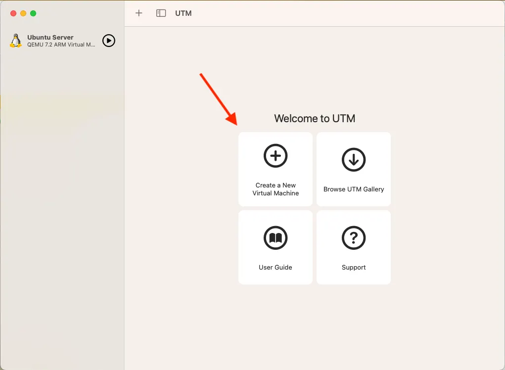

# 🐧 Ubuntu Setup Guide

---

## 💻 **System Requirements**

### **Minimum Requirements**
- **RAM**: 8GB (16GB recommended)
- **Storage**: 60GB free space (100GB recommended)
- **Processor**: 64-bit processor (Intel/AMD) or ARM64 (Apple Silicon)

### **Recommended Setup**
- **RAM**: 16GB or more
- **Storage**: 256GB SSD
- **Processor**: Multi-core processor
- **Graphics**: Dedicated GPU (optional, for simulation)

---

## 💻 **Choose Your Platform**

If you are on Windows then you have two choices here:
    - A Virtual Machine (VM). This will emulate a second computer running Ubuntu 22.04 inside on your computer. This approach usually works well but can come with a lot of overhead, leading to programms running slowly and crashes.
    - Windows Subsystem for Linux (WSL), Microsofts official way of running Linux code on Windows. This approach has much less overhead and runs faster, but can require some extra steps. 


=== "macOS (Apple Silicon) — UTM VM"

    ### **Step 1: Download UTM**
    
    Download UTM from the official website: <https://mac.getutm.app>

    ### **Step 2: Download Ubuntu 22.04 ARM64**
    
    Get Ubuntu 22.04 ARM64 (Desktop or Server): <https://cdimage.ubuntu.mirror.onlime.sl/ubuntu/daily-live/20220417/>  
    *Choose **22.04 LTS 64-bit (ARM)**.*

    ### **Step 3: Create New Virtual Machine**
    
    Open UTM and you'll see the welcome screen with options to create a new virtual machine, browse the gallery, or access user guides.
    
    
    
    Choose [Virtualize] then [Linux], choose your downloaded iso image file, and click [Continue] with all of the boxes unchecked.

    
    
    
    
    Click on Browse and select the ISO file you downloaded in Step 2
    
    

    On the next screen, leave the memory at 4096 MB and CPU Cores at [Default]. Then specify the amount of space you want to allocate to the virtual machine. It is recommended that you don’t go below around 30GB. Leaving it at the default 64GB is fine, or allocate a higher number if you prefer. Preferred space is around 50GB

    
    
   
    
    
    (Optional) Here you can select a storage location for the VM or just leave it as is. This is to configure a shared directory to make files accessible between macOS and your Ubuntu VM. Click "Browse..." to select a folder.
    
    

    Once done, enter the details for your VM as you want and press done.

    ### **Step 4: Start the VM**
    
    Click the play button to start your virtual machine. You'll see the GRUB boot menu where you can select "Try or Install Ubuntu".

    

    
    

    ### **Step 11: Ubuntu Installation Welcome**
    
    The below window will be shown and once done, open up "Install Ubuntu 22.04 LTS". The Ubuntu installer will start and show the welcome screen. Select your language and click "Continue".

    

   
    
    
    
     Choose your keyboard layout. "English (US)" is selected by default. You can test your keyboard in the text field below. (Normally, you can leave it as is and just press continue)
    
    
    
    Uncheck the "Download updates while installing" so that you have a faster installation
    
    

     Select "Erase disk and install Ubuntu" since this is a virtual machine. The installer will show a warning about deleting all files.

    
    
    
    
    
    

    Enter the details you want and press "Continue". The installer will copy files and install Ubuntu. This process may take several minutes depending on your system performance.

    

    Once installation is complete, you'll see the "Installation Complete" screen. Click "Restart Now" to finish the setup.

    ### **Step 6: First Boot**
    
    After restart, you'll see the Ubuntu login screen. Enter your username and password to log in.
    
    ## Troubleshooting

    If your OS doesn't boot up to the welcome screen, restart the VM and press `ESC`, and use your arrow keys to go to "Boot Manager", press "ENTER", go to `ubuntu` and press "ENTER"

    
    You'll be greeted with the Ubuntu desktop environment with the default jellyfish wallpaper. The dock on the left contains common applications.
    

    **References:** 
    
    1. [UTM's Ubuntu guide](https://docs.getutm.app/guides/ubuntu/)
    2. [Blog Post](https://techblog.shippio.io/how-to-run-an-ubuntu-22-04-vm-on-m1-m2-apple-silicon-9554adf4fda1)  

=== "Windows — WSL 2 (Ubuntu 22.04)"
    At the moment, getting the Docker image this course uses working in WSL requires that you have an Nvidia GPU. This can be checked by hitting your Windows key and typing *dxdiag*. A popup will appear asking about checking for signed drivers, you can click either option. This should lead you to a window which looks like:
    
    Click on the Display tabs on the top to see all available GPUs. If none of them are an NVIDIA GeForce chip you should follow the steps to set up the VM on Windows instead of WSL.

    1. Open **Powershell** (search "powershell" in the Windows menu).  
    2. Install Ubuntu 22.04:

        ```powershell
        wsl --install Ubuntu-22.04
        ```

        This installs the exact distro we use. Using a different Ubuntu version often breaks ROS compatibility. *Note: if you have never used WSL before this command will install some necessary drivers first, then say that it failed to install Ubuntu. If this happens reset your computer and try again, it should work now.*

    3. You should notice that powershell has gona from looking like this: 
    
    
    to something like this:
    

    This means you are inside WSL. The green part of the lowest line shows your username and domain, while the blue part shows the folder the terminal is currently inside. From here on out, assume that any command we don't explicilty say to run outside WSL should be run from here. 
        

=== "Windows - VM"

    ### **Step 1: Download UTM**
    
    Download UTM from the official website: <https://mac.getutm.app>

    ### **Step 2: Download Ubuntu 22.04 ARM64**
    
    Get Ubuntu 22.04 ARM64 (Desktop or Server): <https://releases.ubuntu.com/jammy/>
    
    *Choose **22.04 LTS 64-bit (AMD)**.*

    ### **Step 3: Create New Virtual Machine**
    
    Open UTM and you'll see the welcome screen with options to create a new virtual machine, browse the gallery, or access user guides.
    
    
    
    Choose [Virtualize] then [Linux], choose your downloaded iso image file, and click [Continue] with all of the boxes unchecked.

    
    
    
    
    Click on Browse and select the ISO file you downloaded in Step 2
    
    

    On the next screen, leave the memory at 4096 MB and CPU Cores at [Default]. Then specify the amount of space you want to allocate to the virtual machine. It is recommended that you don’t go below around 30GB. Leaving it at the default 64GB is fine, or allocate a higher number if you prefer. Preferred space is around 50GB

    
    
   
    
    
    (Optional) Here you can select a storage location for the VM or just leave it as is. This is to configure a shared directory to make files accessible between macOS and your Ubuntu VM. Click "Browse..." to select a folder.
    
    

    Once done, enter the details for your VM as you want and press done.

    ### **Step 4: Start the VM**
    
    Click the play button to start your virtual machine. You'll see the GRUB boot menu where you can select "Try or Install Ubuntu".

    

    
    

    ### **Step 11: Ubuntu Installation Welcome**
    
    The below window will be shown and once done, open up "Install Ubuntu 22.04 LTS". The Ubuntu installer will start and show the welcome screen. Select your language and click "Continue".

    

   
    
    
    
     Choose your keyboard layout. "English (US)" is selected by default. You can test your keyboard in the text field below. (Normally, you can leave it as is and just press continue)
    
    
    
    Uncheck the "Download updates while installing" so that you have a faster installation
    
    

     Select "Erase disk and install Ubuntu" since this is a virtual machine. The installer will show a warning about deleting all files.

    
    
    
    
    
    

    Enter the details you want and press "Continue". The installer will copy files and install Ubuntu. This process may take several minutes depending on your system performance.

    

    Once installation is complete, you'll see the "Installation Complete" screen. Click "Restart Now" to finish the setup.

    ### **Step 6: First Boot**
    
    After restart, you'll see the Ubuntu login screen. Enter your username and password to log in.
    
    ## Troubleshooting

    If your OS doesn't boot up to the welcome screen, restart the VM and press `ESC`, and use your arrow keys to go to "Boot Manager", press "ENTER", go to `ubuntu` and press "ENTER"

    
    You'll be greeted with the Ubuntu desktop environment with the default jellyfish wallpaper. The dock on the left contains common applications.
    

    **References:** 
    
    1. [UTM's Ubuntu guide](https://docs.getutm.app/guides/ubuntu/)
    2. [Blog Post](https://techblog.shippio.io/how-to-run-an-ubuntu-22-04-vm-on-m1-m2-apple-silicon-9554adf4fda1)  


=== "Linux / Dual-boot (optional)"

    Ubuntu 22.04 LTS native install is fine if you prefer dual-boot. Ensure disk space ≥ **60 GB**.
---


## ⚙️ **Post-Installation Setup**

Open up Terminal using `Ctrl + Alt + T` or from the menu on the bottom left and selecting it.

### **Step 1: Update System**
```bash
sudo apt update && sudo apt upgrade -y
```

### **Step 2: Install Essential Tools**
```bash
# add new package sources so we can find everything we want to install
sudo install -m 0755 -d /etc/apt/keyrings && curl -fsSL https://download.docker.com/linux/ubuntu/gpg | sudo gpg --dearmor -o /etc/apt/keyrings/docker.gpg && sudo chmod a+r /etc/apt/keyrings/docker.gpg

# reload lists
sudo apt update && sudo apt upgrade -y

# install packages we will use to download other things
sudo apt install -y apt-transport-https ca-certificates curl software-properties-common

# grab docker from the internet
curl -fsSL https://download.docker.com/linux/ubuntu/gpg | sudo gpg --dearmor -o /usr/share/keyrings/docker-archive-keyring.gpg

# write the new package sources to our list
echo "deb [signed-by=/usr/share/keyrings/docker-archive-keyring.gpg] https://download.docker.com/linux/ubuntu $(lsb_release -cs) stable" | sudo tee /etc/apt/sources.list.d/docker.list > /dev/null

# reload lists again
sudo apt update

# Development tools
sudo apt install build-essential cmake git curl wget

# Python tools
sudo apt install python3-pip python3-venv python-is-python3

# Docker
sudo apt install docker
sudo apt install docker-compose*

# check to make sure ubuntu actually grabbed all the packages we want
sudo apt install -y docker-ce docker-ce-cli containerd.io docker-buildx-plugin docker-compose-plugin git python-is-python3 docker

```

### **Step 3: Configure Docker to Run as Non-Root User**

By default Docker can only be run as an admin, which will cause it to throw lots of random, hard to diagnose errors. These steps will set up Docker so it can be run by anyone. Docker is *supposed* to run these steps manually, but sometimes doesn't so you may see some random warnings or errors about groups already existing or users already being in the group. This is totally fine, we want to rerun these commands to make sure the entire process worked.

Create the docker group if it does not exist:
```bash
sudo groupadd docker
```
Add your user to the docker group:
```bash
sudo usermod -aG docker $USER
```
Log in to the new docker group (to avoid having to log out and log in again; but if not enough, try to reboot):
```bash
newgrp docker
```
Check if Docker can be run without root:
```bash
docker run hello-world
```
This should download a small program and print a short message confirming that Docker works. If it doesn't, reboot using the command:
```bash
reboot
```
---

## ENME480 Docker Installation

### Step 1: Clone the Repo

Open up [MRC's ENME480 GitHub Repo](https://github.com/MarylandRoboticsCenter/ENME480_mrc). You can either download the zip or open up your terminal

```bash
cd 
git clone https://github.com/MarylandRoboticsCenter/ENME480_mrc.git
```

This will download the repository content into your `HOME` directory. Next, build Docker image (run the command from the docker folder). This needs to be done every time the Docker file is changed. Here's the commands to do that:

**For MacOS users**, change Line no. 4 in the docker file `humble-enme480_ur3e.Dockerfile` 

```
# BEFORE
FROM osrf/ros:humble-desktop AS humble-mod_desktop

# AFTER
FROM arm64v8/ros:humble AS humble-mod_desktop
```
**Do not do this on anything other than a MAC!** MACs require code that has been compiled in a special way in order to work and this code does not work on other computers!


### Step 2: Build and Run the Docker

**For Everyone**, run

```bash
cd ~/ENME480_mrc/docker/
userid=$(id -u) groupid=$(id -g) docker compose -f humble-enme480_ur3e-compose.yml build
```

Once it is successfully built, run the container with:

```bash
docker compose -f humble-enme480_ur3e-compose.yml run --rm enme480_ur3e-docker
```

In the future, some exercises will require you to open multiple terminals in the same Docker image. In order to achieve this, run:

```bash
docker exec -ti <DELETE THIS AND HIT TAB TO AUTOFILL> bash
```
To spawn a new terminal in the already running container. If you repeatedly run the *docker compose* command you will either get errors or create clones of the container which can not talk to one another.

You should see that your name in the terminal has changed from what is was before to *enme480_mrc*. This means you are inside the Docker container and can run ROS code.


### Step 3 (WSL/Native Ubuntu ONLY): Configure Docker to run on NVIDIA GPU
First, try running:

```bash
nvidia-smi
```

You should get an output which looks something like:


*If you do not see an output like this you either don't have an Nvidia GPU or it is not set up correctly. You will not be able to complete the rest of these steps.*

Getting the correct output from nvidia-smi means you have a Nvidia GPU installed in your computer with drivers properly configured. Now, we will enable the GPU within docker to speed up our simulations. First, run the following commands:

```bash
sudo touch /etc/docker/daemon.json

sudo chmod 777 /etc/docker/daemon.json

curl -fsSL https://nvidia.github.io/libnvidia-container/gpgkey | sudo gpg --dearmor -o /usr/share/keyrings/nvidia-container-toolkit-keyring.gpg \
    && curl -s -L https://nvidia.github.io/libnvidia-container/stable/deb/nvidia-container-toolkit.list | \
        sed 's#deb https://#deb [signed-by=/usr/share/keyrings/nvidia-container-toolkit-keyring.gpg] https://#g' | \
        sudo tee /etc/apt/sources.list.d/nvidia-container-toolkit.list

sed -i -e '/experimental/ s/^#//g' /etc/apt/sources.list.d/nvidia-container-toolkit.list

sudo apt-get update

export NVIDIA_CONTAINER_TOOLKIT_VERSION=1.17.8-1
sudo apt-get install -y \
    nvidia-container-toolkit=${NVIDIA_CONTAINER_TOOLKIT_VERSION} \
    nvidia-container-toolkit-base=${NVIDIA_CONTAINER_TOOLKIT_VERSION} \
    libnvidia-container-tools=${NVIDIA_CONTAINER_TOOLKIT_VERSION} \
    libnvidia-container1=${NVIDIA_CONTAINER_TOOLKIT_VERSION}
```

This will install the Nvidia container toolkit which allows Docker to use your GPU. With the container toolkit installed, we can now configure docker and compose our image:

```bash
echo $'{"runtimes": {"nvidia": {"path": "nvidia-container-runtime", "runtimeArgs": []}}}' > /etc/docker/daemon.json && sudo systemctl restart docker
```

This command will add a line to the settings file to enable running with the Nvidia GPU then resets Docker to reload the configuration.

```bash
cd ~/ENME480_mrc/docker/
userid=$(id -u) groupid=$(id -g) docker compose -f humble-enme480_ur3e-nvidia-compose.yml build
```

Finally, this command will compose and run our image. This is the command you will want to run in order to get into the Docker and use ROS. Once it finishes you should see that the username in the terminal will have changed to "enme480_docker" to let you know that you are in the docker container. From now on, this is the command you will use to launch the docker image.

If you do this step you will launch the container with the command:

```bash
docker compose -f humble-enme480_ur3e-nvidia-compose.yml run --rm enme480_ur3e-docker
```

From now on. The command to connect to a running Docker conatiner (i.e. one you have open in a nother terminal) is still:

```bash
docker exec -ti <hit your tab button> bash
```

You should see that your name in the terminal has changed from what is was before to *enme480_mrc*. This means you are inside the Docker container and can run ROS code.

---

## Tests for Week 2

From within the docker iamge, ensure the demo nodes are actually downloaded by running:

```bash
sudo apt update && sudo apt install ros-humble-demo-nodes-cpp
```

To ensure everything is running sucessfully launch the following commands from within the Docker image:

```bash
ros2 run demo_nodes_cpp talker
```

This shouuld begin outputting a list of number to the terminal. Open a new terminal, enter the Docker image and run:

```bash
ros2 run demo_nodes_cpp listener
```


This second script should output the messages being sent by the talker.
### **Test in New Terminal**


```bash
# Open new terminal and run
ros2 --help
# test gazebo, our simulation suite
ign gazebo
```

---

## 🆘 **Getting Help**

### **If Something Goes Wrong**
1. **Check Ubuntu Forums**: [ubuntuforums.org](https://ubuntuforums.org/)
2. **Ask on Piazza**: Course Q&A forum
3. **Office Hours**: Get help from TA or instructor
4. **Ubuntu Documentation**: [help.ubuntu.com](https://help.ubuntu.com/)

### **Emergency Recovery**
- **Boot from USB** and use "Try Ubuntu" mode
- **Reinstall Ubuntu** as last resort

---

*Last updated: Fall 2025 • [Back to Resources](resources.md)*
