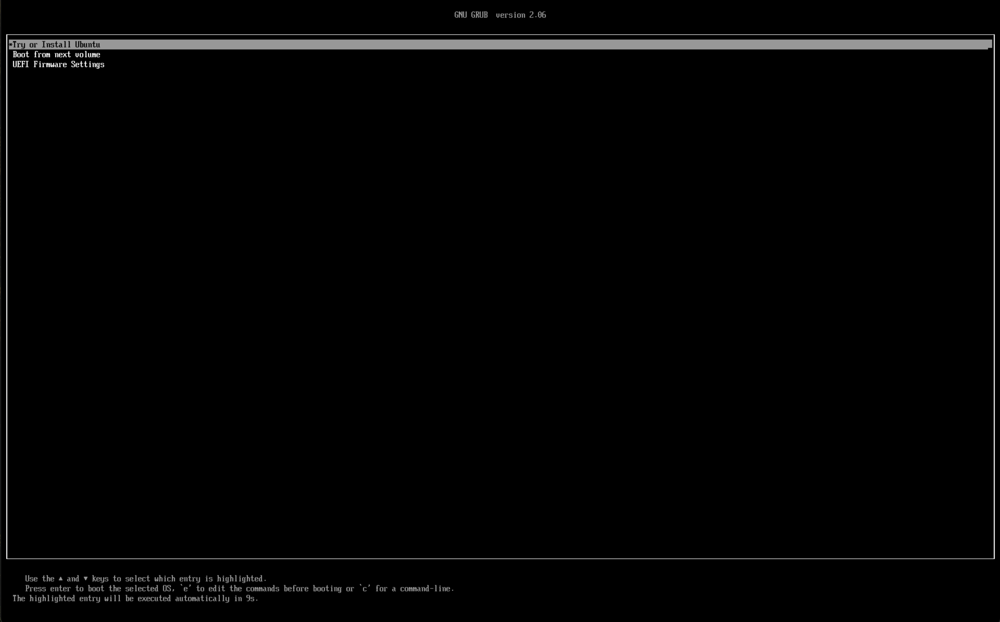

# 🐧 Ubuntu Setup Guide

<div align="center">

**Complete Ubuntu installation and configuration for robotics development**

*Get your Ubuntu environment ready for ROS 2, Python, and robotics tools*

</div>

---

## 🎯 **Overview**

This guide will help you set up Ubuntu 22.04 LTS for ENME480 robotics development. Ubuntu 22.04 is the recommended operating system for ROS 2 Humble and robotics development.

---

## 💻 **System Requirements**

### **Minimum Requirements**
- **RAM**: 8GB (16GB recommended)
- **Storage**: 60GB free space (100GB recommended)
- **Processor**: 64-bit processor (Intel/AMD) or ARM64 (Apple Silicon)

### **Recommended Setup**
- **RAM**: 16GB or more
- **Storage**: 256GB SSD
- **Processor**: Multi-core processor
- **Graphics**: Dedicated GPU (optional, for simulation)

---

## 💻 **Choose Your Platform**

=== "macOS (Apple Silicon) — UTM VM"

    ### **Step 1: Download UTM**
    
    Download UTM from the official website: <https://mac.getutm.app>

    ### **Step 2: Download Ubuntu 22.04 ARM64**
    
    Get Ubuntu 22.04 ARM64 (Desktop or Server): <https://cdimage.ubuntu.mirror.onlime.sl/ubuntu/daily-live/20220417/>  
    *Choose **22.04 LTS 64-bit (ARM)**.*

    ### **Step 3: Create New Virtual Machine**
    
    Open UTM and you'll see the welcome screen with options to create a new virtual machine, browse the gallery, or access user guides.
    
    
    
    Choose [Virtualize] then [Linux], choose your downloaded iso image file, and click [Continue] with all of the boxes unchecked.

    
    
    
    
    Click on Browse and select the ISO file you downloaded in Step 2
    
    

    On the next screen, leave the memory at 4096 MB and CPU Cores at [Default]. Then specify the amount of space you want to allocate to the virtual machine. It is recommended that you don’t go below around 30GB. Leaving it at the default 64GB is fine, or allocate a higher number if you prefer. Preferred space is around 50GB

    
    
   
    
    
    (Optional) Here you can select a storage location for the VM or just leave it as is. This is to configure a shared directory to make files accessible between macOS and your Ubuntu VM. Click "Browse..." to select a folder.
    
    

    Once done, enter the details for your VM as you want and press done.

    ### **Step 4: Start the VM**
    
    Click the play button to start your virtual machine. You'll see the GRUB boot menu where you can select "Try or Install Ubuntu".

    

    
    

    ### **Step 11: Ubuntu Installation Welcome**
    
    The below window will be shown and once done, open up "Install Ubuntu 22.04 LTS". The Ubuntu installer will start and show the welcome screen. Select your language and click "Continue".

    

   
    
    
    
     Choose your keyboard layout. "English (US)" is selected by default. You can test your keyboard in the text field below. (Normally, you can leave it as is and just press continue)
    
    
    
    Uncheck the "Download updates while installing" so that you have a faster installation
    
    

     Select "Erase disk and install Ubuntu" since this is a virtual machine. The installer will show a warning about deleting all files.

    
    
    
    
    
    

    Enter the details you want and press "Continue". The installer will copy files and install Ubuntu. This process may take several minutes depending on your system performance.

    

    Once installation is complete, you'll see the "Installation Complete" screen. Click "Restart Now" to finish the setup.

    ### **Step 6: First Boot**
    
    After restart, you'll see the Ubuntu login screen. Enter your username and password to log in.
    
    ## Troubleshooting

    If your OS doesn't boot up to the welcome screen, restart the VM and press `ESC`, and use your arrow keys to go to "Boot Manager", press "ENTER", go to `ubuntu` and press "ENTER"

    
    You'll be greeted with the Ubuntu desktop environment with the default jellyfish wallpaper. The dock on the left contains common applications.
    

    **References:** 
    
    1. [UTM's Ubuntu guide](https://docs.getutm.app/guides/ubuntu/)
    2. [Blog Post](https://techblog.shippio.io/how-to-run-an-ubuntu-22-04-vm-on-m1-m2-apple-silicon-9554adf4fda1)  

=== "Windows — WSL 2 (Ubuntu 22.04)"

    1. Open **Terminal** (Win+X → *Terminal* or search “terminal”).  
    2. Install Ubuntu 22.04:

        ```powershell
        wsl --install Ubuntu-22.04
        ```

        This installs the exact distro we use. Using a different Ubuntu version often breaks ROS compatibility.

    3. After reboot, you’ll land in the Ubuntu shell (or run `wsl`).  
       **Disk space:** at least **35 GB** free (recommend **50–60 GB**).  

    4. First, we will make sure our dependencies are in place. Within WSL2 run:

        ```bash
        sudo apt update && sudo apt upgrade
        ```

        In order to update all system packages (you may need to enter your password)

        ```bash
        sudo install -m 0755 -d /etc/apt/keyrings && curl -fsSL https://download.docker.com/linux/ubuntu/gpg | sudo gpg --dearmor -o /etc/apt/keyrings/docker.gpg && sudo chmod a+r /etc/apt/keyrings/docker.gpg

        sudo apt update && sudo apt upgrade -y

        sudo apt install -y apt-transport-https ca-certificates curl software-properties-common

        curl -fsSL https://download.docker.com/linux/ubuntu/gpg | sudo gpg --dearmor -o /usr/share/keyrings/docker-archive-keyring.gpg

        echo "deb [signed-by=/usr/share/keyrings/docker-archive-keyring.gpg] https://download.docker.com/linux/ubuntu $(lsb_release -cs) stable" | sudo tee /etc/apt/sources.list.d/docker.list > /dev/null

        sudo apt update
        ```

        These commands set up package registries within WSL, which is how Ubuntu knows where to look for packages (apps) we want to install. If you'd like a more detailed breakdown of what each command here does, feel free to ask a TA.

        ```bash
        sudo apt install -y docker-ce docker-ce-cli containerd.io docker-buildx-plugin docker-compose-plugin git python-is-python3 docker
        ```

        This command will install docker (which we use to standarize everyones ROS installation), git (which we use to sync code across computers) and remaps the name "python3" to "python" to make Ubuntu happier when running our code. 

    5. Now, we will download the code from GitHub. To do this, run:

        ```bash
        cd ~/ && git clone https://github.com/MarylandRoboticsCenter/ENME480_mrc.git
        ```

        To move to the right folder and download the GitHub repo containing the docker image we need.

    6. With that done, we need to make sure the user groups are set up to allow us to compile and run docker images. Run:

        ```bash
        sudo groupadd docker 
        
        sudo usermod -aG docker $USER 
        
        newgrp docker

        sudo systemctl restart docker
        ```

        So that you are able to build and run docker images. These commands make a group who can manage docker images, then add you to it, then resets part of Ubuntu so it recognizes the new group. Once this is done, all the parts are in place to build our docker image.

    7. Now, we will build our image.

        ```bash
        cd ~/ENME480_mrc/docker && userid=$(id -u) groupid=$(id -g) docker compose -f humble-enme480_ur3e-compose.yml build
        ```

        The first part of this command (before the &&) puts you in the folder containing the docker image we want to build, while the second part actually builds our image. This step can take a while, since you have to download a lot of data. If you get a permission error at this step try restarting wsl.

        In the future, you can use the command

        ```bash
        docker compose -f humble-enme480_ur3e-compose.yml run --rm enme480_ur3e-docker
        ```

        To launch a new docker container. Once the container is open in one terminal, you can run

        ```bash    
        docker exec -ti <hit your tab button> bash
        ```

        To launch a new terminal connected to the docker image.

=== "Windows - VM"

    ### **Step 1: Download UTM**
    
    Download UTM from the official website: <https://mac.getutm.app>

    ### **Step 2: Download Ubuntu 22.04 ARM64**
    
    Get Ubuntu 22.04 ARM64 (Desktop or Server): <https://releases.ubuntu.com/jammy/>
    
    *Choose **22.04 LTS 64-bit (AMD)**.*

    ### **Step 3: Create New Virtual Machine**
    
    Open UTM and you'll see the welcome screen with options to create a new virtual machine, browse the gallery, or access user guides.
    
    
    
    Choose [Virtualize] then [Linux], choose your downloaded iso image file, and click [Continue] with all of the boxes unchecked.

    
    
    
    
    Click on Browse and select the ISO file you downloaded in Step 2
    
    

    On the next screen, leave the memory at 4096 MB and CPU Cores at [Default]. Then specify the amount of space you want to allocate to the virtual machine. It is recommended that you don’t go below around 30GB. Leaving it at the default 64GB is fine, or allocate a higher number if you prefer. Preferred space is around 50GB

    
    
   
    
    
    (Optional) Here you can select a storage location for the VM or just leave it as is. This is to configure a shared directory to make files accessible between macOS and your Ubuntu VM. Click "Browse..." to select a folder.
    
    

    Once done, enter the details for your VM as you want and press done.

    ### **Step 4: Start the VM**
    
    Click the play button to start your virtual machine. You'll see the GRUB boot menu where you can select "Try or Install Ubuntu".

    

    
    

    ### **Step 11: Ubuntu Installation Welcome**
    
    The below window will be shown and once done, open up "Install Ubuntu 22.04 LTS". The Ubuntu installer will start and show the welcome screen. Select your language and click "Continue".

    

   
    
    
    
     Choose your keyboard layout. "English (US)" is selected by default. You can test your keyboard in the text field below. (Normally, you can leave it as is and just press continue)
    
    
    
    Uncheck the "Download updates while installing" so that you have a faster installation
    
    

     Select "Erase disk and install Ubuntu" since this is a virtual machine. The installer will show a warning about deleting all files.

    
    
    
    
    
    

    Enter the details you want and press "Continue". The installer will copy files and install Ubuntu. This process may take several minutes depending on your system performance.

    

    Once installation is complete, you'll see the "Installation Complete" screen. Click "Restart Now" to finish the setup.

    ### **Step 6: First Boot**
    
    After restart, you'll see the Ubuntu login screen. Enter your username and password to log in.
    
    ## Troubleshooting

    If your OS doesn't boot up to the welcome screen, restart the VM and press `ESC`, and use your arrow keys to go to "Boot Manager", press "ENTER", go to `ubuntu` and press "ENTER"

    
    You'll be greeted with the Ubuntu desktop environment with the default jellyfish wallpaper. The dock on the left contains common applications.
    

    **References:** 
    
    1. [UTM's Ubuntu guide](https://docs.getutm.app/guides/ubuntu/)
    2. [Blog Post](https://techblog.shippio.io/how-to-run-an-ubuntu-22-04-vm-on-m1-m2-apple-silicon-9554adf4fda1)  


=== "Linux / Dual-boot (optional)"

    Ubuntu 22.04 LTS native install is fine if you prefer dual-boot. Ensure disk space ≥ **60 GB**.
---


## ⚙️ **Post-Installation Setup**

Open up Terminal using `Ctrl + Alt + T` or from the menu on the bottom left and selecting it.

### **Step 1: Update System**
```bash
sudo apt update && sudo apt upgrade -y
```

### **Step 2: Install Essential Tools**
```bash
# Development tools
sudo apt install build-essential cmake git curl wget

# Python tools
sudo apt install python3-pip python3-venv
```

If you are *not* running WSL (WSL will install VScode in Windows):
```bash
# Text editors
sudo apt install code  # VS Code
sudo apt install gedit  # Simple text editor
```

**If you are running in a VM, run the following command**
Do not run this if you are using WSL, it will break your Docker installation.
```bash
# Docker
sudo apt install docker
sudo apt install docker-compose*

```

### **Step 3: Configure Python**
```bash
# Make sure you can call python via 'python' instead of 'python3'
sudo apt install python-is-python3

# Install common packages
pip install numpy matplotlib scipy
```

### **Step 4: Configure Docker to Run as Non-Root User**

If you want to run Docker as a non-root user, then you need to add your user to the docker group.

Create the docker group if it does not exist:
```bash
sudo groupadd docker
```
Add your user to the docker group:
```bash
sudo usermod -aG docker $USER
```
Log in to the new docker group (to avoid having to log out and log in again; but if not enough, try to reboot):
```bash
newgrp docker
```
Check if Docker can be run without root:
```bash
docker run hello-world
```
Reboot if you still get an error:
```bash
reboot
```
---

## ENME480 Docker Installation

### Step 1: Clone the Repo

Open up [MRC's ENME480 GitHub Repo](https://github.com/MarylandRoboticsCenter/ENME480_mrc). You can either download the zip or open up your terminal

```bash
cd 
git clone https://github.com/MarylandRoboticsCenter/ENME480_mrc.git
```

This will download the repository content into your `HOME` directory. Next, build Docker image (run the command from the docker folder). This needs to be done every time the Docker file is changed. Here's the commands to do that:

**For MacOS users**, change Line no. 4 in the docker file `humble-enme480_ur3e.Dockerfile` 

```
# BEFORE
FROM osrf/ros:humble-desktop AS humble-mod_desktop

# AFTER
FROM arm64v8/ros:humble AS humble-mod_desktop
```

### Step 2: Build and Run the Docker

**For Everyone**, run

```bash
cd ~/ENME480_mrc/docker/
userid=$(id -u) groupid=$(id -g) docker compose -f humble-enme480_ur3e-compose.yml build
```

Once it is successfully built, run the container

```bash
docker compose -f humble-enme480_ur3e-compose.yml run --rm enme480_ur3e-docker
```

### Step 3 (OPTIONAL): Configure Docker to run on NVIDIA GPU
First, try running:

```bash
nvidia-smi
```

You should get an output which looks something like:


*If you do not see an output like this you either don't have an Nvidia GPU or it is not set up correctly. You will not be able to complete the rest of these steps.*

Getting the correct output from nvidia-smi means you have a Nvidia GPU installed in your computer with drivers properly configured. Now, we will enable the GPU within docker to speed up our simulations. First, run the following commands:

```bash
sudo touch /etc/docker/daemon.json

sudo chmod 777 /etc/docker/daemon.json

curl -fsSL https://nvidia.github.io/libnvidia-container/gpgkey | sudo gpg --dearmor -o /usr/share/keyrings/nvidia-container-toolkit-keyring.gpg \
    && curl -s -L https://nvidia.github.io/libnvidia-container/stable/deb/nvidia-container-toolkit.list | \
        sed 's#deb https://#deb [signed-by=/usr/share/keyrings/nvidia-container-toolkit-keyring.gpg] https://#g' | \
        sudo tee /etc/apt/sources.list.d/nvidia-container-toolkit.list

sed -i -e '/experimental/ s/^#//g' /etc/apt/sources.list.d/nvidia-container-toolkit.list

sudo apt-get update

export NVIDIA_CONTAINER_TOOLKIT_VERSION=1.17.8-1
sudo apt-get install -y \
    nvidia-container-toolkit=${NVIDIA_CONTAINER_TOOLKIT_VERSION} \
    nvidia-container-toolkit-base=${NVIDIA_CONTAINER_TOOLKIT_VERSION} \
    libnvidia-container-tools=${NVIDIA_CONTAINER_TOOLKIT_VERSION} \
    libnvidia-container1=${NVIDIA_CONTAINER_TOOLKIT_VERSION}
```

This will install the Nvidia container toolkit which allows Docker to use your GPU. With the container toolkit installed, we can now configure docker and compose our image:

```bash
echo $'{"runtimes": {"nvidia": {"path": "nvidia-container-runtime", "runtimeArgs": []}}}' > /etc/docker/daemon.json && sudo systemctl restart docker
```

This command will add a line to the settings file to enable running with the Nvidia GPU then resets Docker to reload the configuration.

```bash
docker compose -f humble-enme480_ur3e-nvidia-compose.yml run --rm enme480_ur3e-docker
```

Finally, this command will compose and run our image. This is the command you will want to run in order to get into the Docker and use ROS. Once it finishes you should see that the username in the terminal will have changed to "enme480_docker" to let you know that you are in the docker container. From now on, this is the command you will use to launch the docker image.

If you do this step you will launch the container with the command

```bash
docker compose -f humble-enme480_ur3e-nvidia-compose.yml run --rm enme480_ur3e-docker
```

From now on. The command to connect to a running Docker conatiner (i.e. one you have open in a nother terminal) is still

```bash
docker exec -ti <hit your tab button> bash
```

---

## Tests for Week 2

To ensure everything is running sucessfully launch the following commands from within the Docker image:

```bash
ros2 run demo_nodes_cpp talker
```

This shouuld begin outputting a list of number to the terminal. Open a new terminal, enter the docer image and run:

```bash
ros2 run demo_nodes_cpp listener
```


This second script should output the messages being sent by the talker.
### **Test in New Terminal**


```bash
# Open new terminal and run
ros2 --help
# test gazebo, our simulation suite
ign gazebo
```
---

## 🔧 **Common Issues & Solutions**

### **Boot Issues**
| **Problem** | **Solution** |
|-------------|--------------|
| **Grub not showing** | Boot from USB, run `sudo grub-install` |
| **Windows not in boot menu** | Run `sudo update-grub` |
| **Can't boot Windows** | Use Windows recovery tools |

### **Graphics Issues**
| **Problem** | **Solution** |
|-------------|--------------|
| **Black screen** | Boot with `nomodeset` kernel parameter |
| **Low resolution** | Install graphics drivers |
| **No display** | Check monitor connections |

### **Network Issues**
| **Problem** | **Solution** |
|-------------|--------------|
| **WiFi not working** | Install proprietary drivers |
| **Ethernet not working** | Check cable and drivers |
| **Slow internet** | Update network drivers |

---

## 📱 **Essential Ubuntu Commands**

### **System Management**
```bash
# Update package list
sudo apt update

# Upgrade packages
sudo apt upgrade

# Install package
sudo apt install package_name

# Remove package
sudo apt remove package_name

# Search packages
apt search keyword

# System info
lsb_release -a
uname -a
```

### **File Management**
```bash
# List files
ls -la

# Change directory
cd directory_name

# Create directory
mkdir new_directory

# Copy files
cp source destination

# Move files
mv source destination

# Remove files
rm filename
```

### **Process Management**
```bash
# List processes
ps aux

# Kill process
kill process_id

# System monitor
htop

# Disk usage
df -h
```

---

## 🎨 **Customization (Optional)**

### **Install Additional Software**
```bash
# Media players
sudo apt install vlc

# Image editing
sudo apt install gimp

# Office suite
sudo apt install libreoffice

# Web browsers
sudo apt install firefox
```

### **Customize Desktop**
- **Change wallpaper**: Right-click desktop → Change Background
- **Install themes**: Settings → Appearance
- **Customize dock**: Settings → Dock
- **Add extensions**: Ubuntu Software → Extensions

---

## ✅ **Verification Checklist**

- [ ] Ubuntu boots successfully
- [ ] System updates completed
- [ ] Essential tools installed
- [ ] Python environment configured
- [ ] Network working properly
- [ ] Graphics drivers installed
- [ ] System running smoothly

---

## 🆘 **Getting Help**

### **If Something Goes Wrong**
1. **Check Ubuntu Forums**: [ubuntuforums.org](https://ubuntuforums.org/)
2. **Ask on Piazza**: Course Q&A forum
3. **Office Hours**: Get help from TA or instructor
4. **Ubuntu Documentation**: [help.ubuntu.com](https://help.ubuntu.com/)

### **Emergency Recovery**
- **Boot from USB** and use "Try Ubuntu" mode
- **Use Windows recovery** if dual boot fails
- **Reinstall Ubuntu** as last resort

---

*Last updated: Fall 2025 • [Back to Resources](resources.md)*
